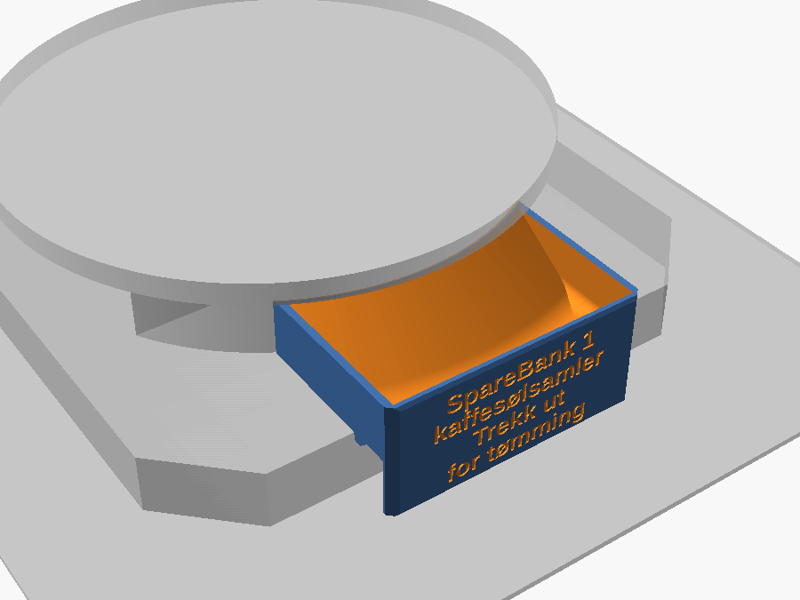
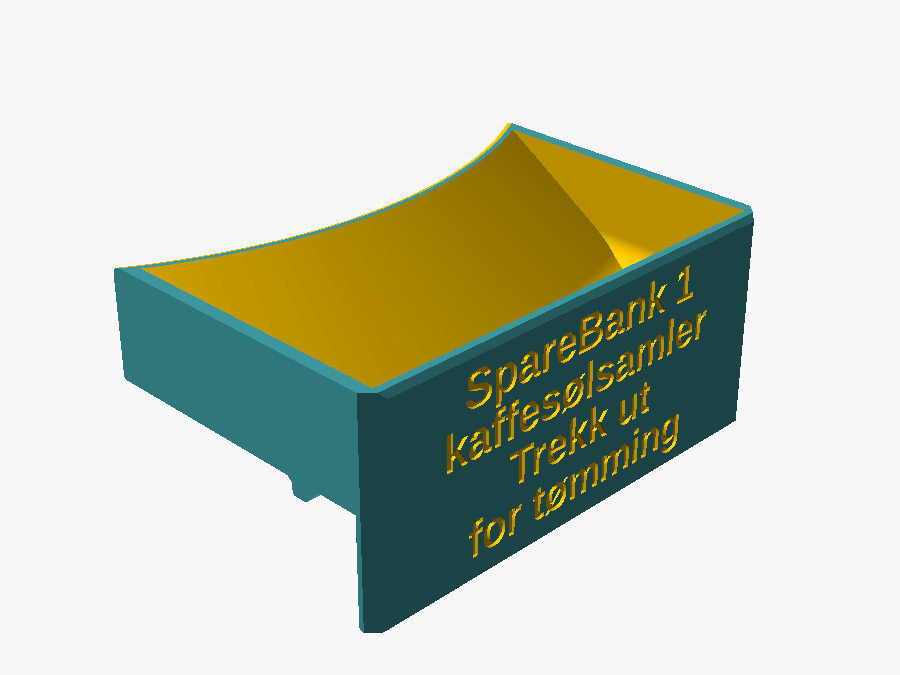
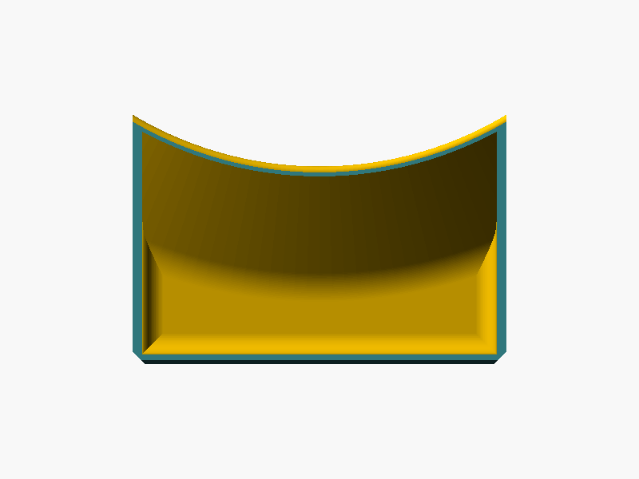
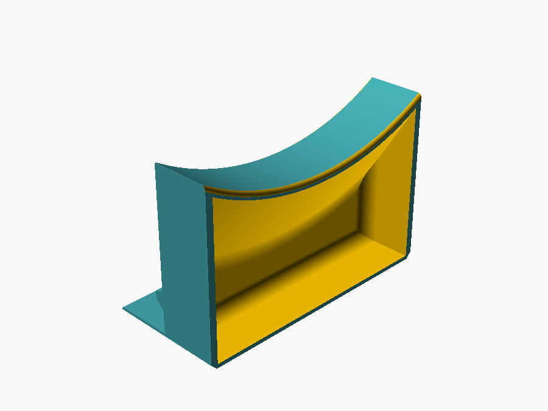

# Coffee spill tray

> Norsk versjon: [README.no.md](README.no.md)

A shallow trough that catches the coffee that runs down the outside of the pot and
out across the plate, instead of letting it end up on the table and in a paper
towel. It sits on the free front part of the teak plate under the internet
connected coffee scale, reaches out over the front edge of the plate, and closes
off at the back against whatever the sensor rig has standing there.

There are **two kinds of rig**, and the parameter `base` picks which one the build
is for – `"box"` for the grey electronics box, `"round"` for a curved base under
the weighing bowl. Everything else is shared. Start at
[Two rigs, one file](#two-rigs-one-file) if you are not sure which one you have.


The body is **90 × 48 × 20.5 mm** over the plate and holds **about 46 ml** on the
box base, 90 × 60 mm and about 51 ml on the round one. It rests on the plate over
the rear 30 mm, the front 18 mm reach out past the edge of the plate, and the front
wall carries on down to the table – and carries a four line label, recessed into
the black body and filled with white on the second extruder:


## Two rigs, one file

Walking round to the other coffee sensors turned up something the first tray had
not accounted for: **most of the rigs do not have the grey square electronics box
at all.** They have a curved base under the weighing bowl, and a flat rear face
with two arms has nothing to grip there. So the rear of the tray is switchable:

| `base` | What stands behind the tray | How the tray closes off against it |
|---|---|---|
| `"box"` | the grey 3D printed electronics box, a square block 76 mm wide and 22 mm tall | a flat rear face plus two arms, one down each side of it |
| `"round"` | a curved base, R 87 mm, drawn as a 120° arc | a concave arc of R 87.4 mm that nests into it. No arms at all. |

This is one file with a switch rather than two files, because the two variants
share the trough, the ramp, the leg, the tongue, the text, the print orientation
and every last fillet. The rear face is genuinely all that differs, and a fork
would have doubled every future edit – including two READMEs.

**The arc is a better locator than the arms ever were.** Two curved surfaces of the
same radius held together locate each other in *both* axes at once: the tray
centres itself sideways and squares itself up as it is pushed home, with no fit
tolerance to guess at, no spring arms, and nothing to break loose with a jerk. The
0.4 mm `base_clear` is there so the two surfaces touch along the whole arc instead
of binding on the high spot of one print.



It also gains capacity for nothing. The base curves *away* from the tray towards
the sides, so where the flat-backed version had to stop at the nearest point, the
arc keeps going:

| Round base | Value |
|---|---|
| Depth on the centreline | 47.6 mm |
| Depth at the corners | 60.1 mm – 12.5 mm further back, and all of it trough rather than wall |
| Capacity | 50.6 ml, against 46.5 on the box base |
| Total depth of the part | 60.1 mm; the box version is 66 mm because of the arms |
| Material | 52.6 cm³, approx. 67 g |
| Arc | R 87.4 mm outside, R 89.8 mm inside, centred 135 mm behind the front face, `base_fn` = 240 segments (chord error 0.007 mm) |
| Rear corners in plan | filleted `rear_corner_r` = 3 mm, which the box version cannot do – see below |



The floor is a saddle: the rear ramp is the 35° profile revolved about the axis of
the arc, so it sweeps up towards the back and the corners at once, and the flat part
of the floor is deepest right across the front.



Four numbers in the round section of the file are still **placeholders that want a
caliper**, and they are marked `MEASURE THIS` in the source:

| Parameter | Placeholder | What to measure |
|---|---|---|
| `plate_depth_round` | 30 mm, copied from the box rig | free plate from the front edge in to the *nearest* point of the curved base. This is the one that moves everything: it sets how far back the arc sits. Print `mode = "gauge"` and check it against the rig. |
| `base_h` | 20 mm | height of the curved base above the plate. Only the ghost in `mode = "check"` uses it, but it is what tells you the arc is tall enough to be worth having. |
| `disc_r` | 95 mm | radius of the weighing bowl, which overhangs the base – clearly visible in the photos of the rigs |
| `disc_z` | 24 mm | height of the underside of that bowl above the plate. Together with `disc_clear` = 1.5 mm it is what limits `tray_height`, and an `assert` enforces it. |

`base_r` = 87 mm itself is not a guess: it is off the CAD drawing of the base, which
gives R 87.00, diameter 174.00 and arc length 182.25 mm. 182.25 / 87 = 2.094 rad =
**120.0°**, so the base is a designed 120° arc of chord 150.7 mm, and the 90 mm
tray spans ±31° of it – well inside the ends.

## Main dimensions

These are the box base numbers; the round base differs only in the table above.

| Dimension | Value | Where it comes from |
|---|---|---|
| Body width | 90 mm | started at 80, the width of the tongue on the front of the plate. It is 90 now to give the text on the front face room to breathe. Still the widest point of the part – the arms are set *inside* the sides, not outside them. |
| Depth on the plate | 30 mm | free plate from the front edge in to the grey socle. Fixed by the rig: the body cannot get any deeper at the back. |
| Overhang | 18 mm | out past the front edge of the plate, so drips that run over the edge are caught too. Was 10; the shallower rear ramp (see below) needs 7 mm more depth than a 45° one, and since the back is up against the socle, the extra depth is added here. It is free: the leg stands on the table at the very front, so the overhang is carried rather than cantilevered, and the pivot lever gets better (see `foot_clear`). |
| Body depth | 48 mm | 18 + 30 |
| Total depth | 66 mm | the right arm reaches 18 mm further back, alongside the grey socle. The left one is cut to 14 mm to clear a connector on the rig. |
| Rim height over the plate | 20.5 mm | the grey socle is 22 mm, and there are several mm of air from its top up to the big grey cup, so the rim has room to spare. Fitted with the 2 mm gauge. |
| Height of the plate over the table | 20.6 mm | how far the leg reaches down (`plate_height`), fitted with the gauge |
| Total height | 40.8 mm | from the table to the rim |
| Walls / floor | 2.4 / 2.0 mm | |
| Trough | 18.5 mm deep, 46 ml to the rim | measured from `mode = "cavity"` |
| Text on the front face | four lines, 6.5 mm, recessed 0.6 mm, white inlay | `text_lines` / `text_size`, see below |

The rig itself, measured with the caliper – these are the numbers the fit is
derived from:

| The rig (box base) | Value |
|---|---|
| Grey printed socle, width | 76 mm |
| Grey printed socle, height above the teak plate | 22 mm |
| Grey printed socle, depth backwards | not measured, "a lot", around 76 mm |
| Teak plate, thickness | 19 mm |
| Teak plate, top surface over the table | 20.6 mm (`plate_height`, fitted with the gauge) |
| Teak plate, plan | 200 × 200 mm with all four corners cut at 45°, leaving a short edge of about 37 mm – an octagon. The tray sits centred on the middle of the front edge, which stays flat for about 148 mm, so the corner cuts are nowhere near it. Only the ghost in `mode = "check"` cares. |

## It may rest on the table

The load cell sits up inside the grey cup the pot stands in, so both the teak
plate and the table are dead support **below** the measuring path. Whatever the
tray leans on therefore has no effect on the weight reading, and standing on the
table is a plain advantage: the overhang gets carried instead of cantilevered.

That is what the front wall does – it continues down past the edge of the plate
and stands on the table:


From the front backwards in the section: the **leg** (4 mm thick, down to the
table), the **locating tongue** that hangs down in front of the front face of the
plate and keeps the tray from sliding backwards towards the pot, and then the flat
underside that rests on the plate.

Three details in the section that are there on purpose:

- **`foot_clear = 0.3` shortens the leg.** The tray pivots on the front edge of
  the plate, and the leg stands 18 mm in front of that edge while the rear edge is
  30 mm behind it. A leg that is *e* mm too long therefore lifts the rear edge by
  *1.7 e* mm and eats into the clearance under the grey cup – the longer overhang
  helps here, it used to be *3 e*. 0.3 mm is little enough
  that the leg takes over as soon as anything presses on the overhang, and enough
  that the tray never rocks. Set it to 0 for firm contact. On the round base the
  rear corners are 42 mm behind the pivot rather than 30, so a long leg lifts them
  *2.3 e* – which is the one place the extra depth costs something, and the reason
  `disc_z` is worth measuring rather than assuming.
- **A 45° chamfer on the front face of the tongue**, from the back of the leg down
  to the bottom front corner of the tongue. That face would otherwise be a ceiling
  in the print – see below. It fills the gap between the leg and the tongue with a
  wedge, which is harmless because it all sits in front of the plate edge.
- **`hook_relief = 1.0`** cuts a 45° relief in the inner corner where the
  underside meets the tongue, so a rounded or slightly chamfered plate edge still
  lets the tray seat flat.

The tray weighs about 65 g – 67 g on the round base – which becomes a fixed offset
either way: **tare the scale** with the empty tray in place.

## The two arms – a slip fit, on purpose

*Box base only. On the round base `clamp_enable` is ignored, there are no arms, and
the arc does this job better – see above.*

The thing worth reaching around is the **grey printed socle** that carries the
sensor: a block 76 mm wide standing 22 mm up from the teak plate, right behind the
tray. Two fins 3.2 mm thick reach backwards from the rear face, one along each
side of it.

They started life as spring arms that clamped the socle, and they are **not that
any more**. `clamp_squeeze` is **−0.4 mm**, i.e. the opening is 0.4 mm *wider*
than the socle rather than narrower. The arms locate the tray sideways and keep it
square to the rig; the locating tongue and the weight of the tray do the holding.
A grip that has to be broken releases with a jerk, and a tray with coffee residue
in it being pulled forwards for emptying is the last place you want a jerk. Raise
`clamp_squeeze` above 0 to get a real grip back – but read the next section first.

Getting there took four printed tests: 0.4 mm total interference, which splayed
the `gauge_clamp` out so it would not seat, then 0.2, then 0.1, then past zero to
−0.1 – and then **one of the arms on the finished tray snapped while it was being
seated**, so it is −0.4 now.

### Why an arm snapped, and the three things that changed

A 0.05 mm interference should be nothing, and by the beam formula in the table
below it is nothing: a fraction of a newton. The formula is not the problem. The
**layer direction** is.

The tray prints on its front face, so the arms grow *along the print axis* – each
layer adds a slice of arm, and the layer boundaries run across the arm from the
outer face to the guiding face. Bending an arm sideways, which is exactly what
pushing the tray onto a socle a shade too wide for it does, pulls those layer
boundaries apart in tension. A layer boundary in PLA+ is the weakest plane in the
part, roughly half the strength of solid material, and it is not ductile: it does
not bend and spring back, it splits. That is what the beam formula, which assumes
an isotropic material, has no way of telling you.

Three changes follow, and the file makes all three:

1. **Take the interference away.** `clamp_squeeze` −0.1 → **−0.4**, the extra
   0.3 mm asked for. An arm that never touches anything is never stressed, and
   0.2 mm of air per side is still far inside the sideways slop that would matter.
2. **Thicken the arm.** `clamp_t` 2.05 → **3.2 mm**. Against a *load* – a knock, a
   hand, catching the rig on the way in – stress goes as 1/thickness², so this
   cuts it by more than half. Note that it only helps *because* of (1): if the arm
   were still being forced apart by a fixed distance, a thicker arm would see
   **more** stress, not less, because for an imposed deflection stress goes as
   thickness × deflection. Thickness and clearance are not independent knobs.
3. **Flare the root.** `clamp_root` = **2.5 mm** adds a 45° gusset where the arm
   leaves the rear face – the point of largest bending moment, and previously a
   sharp inside corner that concentrated it further. It can only go on the *outer*
   face, since the guiding face has to stay flat over its whole length, so the arm
   is 5.7 mm thick at the root tapering to 3.2 mm over the first 2.5 mm. It is
   free to print: drawn in plan, the gusset is a wedge lying along the print axis,
   no overhang and no support.

If you print in PETG instead this is all less pressing – PETG layer adhesion is
much better than PLA+'s – but the geometry costs nothing either way.

The two arms are **not the same length**. The right one runs the full 18 mm, but
the left one butts into a connector on the rig a little way back, so it is cut to
14 mm (`clamp_len_l` / `clamp_len_r`; left and right are seen from the front,
standing where the overhang points at you, so the left arm is the one at x = 0 –
swap the two numbers if it turns out to be the other side on your rig).

Seen from above, with the rim at the bottom and the arms reaching back:


The arms are **no longer flush with the sides**. They were, back when the body was
80 mm and the socle 76: 2.05 mm of thickness landed exactly in the 2 mm step on
each side. At 90 mm the same rule would demand a 7 mm slab, so the two are
decoupled – `clamp_t` is the thickness the fin needs, and the arms sit 3.6 mm in
from the sides of the body wherever the socle puts them. That set-in is also the
ceiling on the arm: the gusset has to stay inside the width of the tray, which
caps `clamp_t + clamp_root` at 7 mm, so `clamp_t` cannot go past about 4.3 mm at
`clamp_root` = 2.5. An assert says so.

| | |
|---|---|
| Guiding faces | x = 6.8 and 83.2, i.e. an opening of 76.4 mm on the 76 mm socle: 0.2 mm of clearance per side |
| Arm | 3.2 mm thick, 5.7 mm at the flared root, 17.5 mm tall, 18 mm free length on the right, 14 mm on the left |
| Mouth at the free end | 78.4 mm, relieved `clamp_lead` = 1.0 mm per side so the front corners of the socle guide the tray in instead of catching on the arm tips, closing in over the last 6 mm |
| Bottom of the arm | 1.5 mm above the plate (`clamp_z0`), to clear any fillet or elephant foot at the base of the socle |
| Top of the arm | 19 mm = `tray_height - edge_r`; any higher and the rounding of the rim would thin the arm to a knife edge |
| If you do put interference back | as an isotropic leaf spring, `k = 3EI/L³` with `I = b·t³/12` gives about 50 N/mm on the 18 mm arm in PETG at 3.2 mm thick, half again as much in PLA+, and stiffness goes as 1/length³ so the short 14 mm arm is 2.1 times stiffer again. **But the arm is not isotropic** – see the section above on why one of them split at a layer boundary. Treat these numbers as an upper bound on what the arm can take, not a design target. |

## Rounded edges, and why not `minkowski()`

| Edge | Treatment |
|---|---|
| The four long outer edges, running along the depth | fillet `edge_r` = 1.5 mm |
| The whole perimeter of the front face | 45° chamfer `front_c` = 1.0 mm |
| The two front corners, seen from above | 45° cut `corner_c` = 3 mm |
| Rear edge of the rim | fillet `rear_r` = 1.5 mm |
| Rear edge of the underside | fillet `under_r` = 0.8 mm |
| Inner edge of the foot, edges of the locating tongue | fillet `foot_r` = 0.6 mm |
| Top and bottom of the arms, outer side | fillet `arm_r` = 0.8 mm |
| Free end of the arms, seen from above | fillet `clamp_r` = 0.4 mm |
| The rear corners seen from above | left square on the box base – they face the socle, and the arms are rooted in those corners. Filleted `rear_corner_r` = 3 mm on the round base, where nothing is rooted there and a corner at the far end of a 60 mm reach is exactly the one you catch a sleeve on. It is free in the print: a vertical edge in the model lies *along* the print axis, so rounding it in plan just curves the outline of each layer. The front corners are the exception, and stay 45° chamfers, because there the fillet would be tangent to the bed. |
| The guiding faces | left square – they are the faces that touch the socle |
| The concave arc, top and bottom edges | the same `rear_r` = 1.5 mm and `under_r` = 0.8 mm fillets as the flat rear face, revolved round the arc |

**Everything that meets the print bed is chamfered at 45°, not filleted.** A fillet
along the bottom edge is tangent to the bed, so the first layer comes out inset
and the second one hangs about 0.8 mm out over nothing; it prints as a rough
drooping lip. 45° is the steepest overhang that comes out clean, and a chamfered
edge is no longer sharp to the hand. Everything else is a true fillet, and costs
nothing in the print: the long edges are prisms along the print axis, and the
fillets on the rear face and the underside only shrink the cross section as the
print grows upwards. Measured on the finished STL, no surface in the part faces
the bed at more than exactly 45°.

`minkowski()` with a sphere would round the lot in one line, and it is the right
tool on a plain box. Not here: a Minkowski sum replaces every point of the solid
with a ball of radius *r*, so **every outward face grows by *r*** – that is the
definition, not a quirk. The usual correction is to build the source solid *r*
smaller first (`cube([w-2*r, d-2*r, h-2*r])` plus `sphere(r)` gives exactly
w × d × h), but there is no single scalar to shrink here, and worse: it would
close the mouth between the arms by 2 *r* and make the leg down to the
table *r* longer – exactly the two dimensions that must not move. `offset()` and
tangent fillet arcs only ever remove material, so the arm spacing (76.4/76 mm)
and the leg (20.3 mm) come out exactly as measured. Rounding one named corner at
a time also keeps the concave corners square, which `minkowski()` would do too but
`offset(r) offset(-r)` would not.

## Printed on the front face – and why

The part is printed **lying on its front face**, so the print axis runs backwards
along the depth of the tray.


An earlier version stood on one short end, which is the obvious choice for the
trough on its own. The arms make that impossible: both guiding faces are planes
at constant x, and standing the part on end puts the print axis along x, which
turns those planes into layer planes – the inner face of the upper arm becomes a
ceiling hanging over nothing. Standing the tray upright is worse: the whole
underside would be a 30 × 90 mm ceiling in the air above the leg.

The round base wants the same orientation for a different reason. The concave arc
faces backwards, so laid on the front face it faces straight *up* – the one
direction that is never an overhang – and being a surface of revolution about a
vertical axis it is a prism along the print axis everywhere it is not being
filleted. It needs no support either.



Lying on the front face, every surface that has to be vertical – the guiding
faces, the sides of the arms – runs parallel to the print axis and comes out
exactly as drawn. The whole front face becomes the first layer, 90 × 40.8 mm of
solid contact with the bed, and the floor and the walls of the trough are printed
as one continuous outline in every single layer, so the corner where they meet is
not a layer boundary the coffee can seep through. The two arms end up as the last
14 and 18 mm of the print: two fins standing on the rear face, each with a
3.2 × 17.5 mm footprint (5.7 mm at the flared root). They print fine, but slow the last layers down if your slicer does not
do it by itself.

Only two surfaces face the bed in this orientation:

1. **The inside of the rear wall.** The floor of the trough rises to the rim over
   a fillet of radius `rear_fillet` = 12 mm and then a straight run at
   `rear_angle` = **35°**. It was 45° – the textbook limit for an unsupported
   overhang – and the first print came out visibly rough and drooping along that
   whole face in PLA. 45° means each layer steps a full layer height sideways, so
   every bead is laid half in the air; at 35° it steps only 0.7 of a layer height
   and there is real material under each bead. Run the part cooling fan flat out
   over those layers.

   The shallower ramp costs depth: `rear_fillet · sin a + (cav_rise −
   rear_fillet · (1 − cos a)) / tan a` is **30.2 mm** at 35° against 23.5 mm at
   45°. Since the socle fixes the back, those 7 mm came out of the front as
   `overhang` 10 → 18. What is left is a fully flat floor of 75.2 × 8.0 mm at the
   front, and the ramp is as much a feature as a cost. The trough is deepest at
   the front, so a spill collects out over the table edge and away from the rig.
   And the long shallow slope is where the drips actually land: a drop hitting it
   spreads into a thin film over a much larger area than the 2 mm puddle it would
   make on a flat floor, and that film has cooled well down by the time it reaches
   the bottom. More area, less depth, less heat – all three in the right
   direction, and in PLA the last one is the one that matters.
2. **The front face of the locating tongue**, chamfered at 45° as described above.

Measured on the finished STL, 2423 mm² of surface faces the bed at 35° (the ramp)
and 943 mm² at exactly 45° (the chamfers). Nothing is steeper.

On the round base that ramp is the same profile revolved about the axis of the arc,
and revolving it *helps*: as the ramp curves round towards the sides, its normal
picks up an x component, so the steepest overhang on the whole ramp is the 35° on
the centreline and everything either side of it is shallower. Measured on
`coffee_spill_mug_round.stl`: 907 mm² at 35°, another 1686 mm² spread from 34° down
to 30° as the ramp swings round, the rest shallower still, and 943 mm² at exactly 45° – the same chamfers,
unchanged. Nothing steeper than 45° anywhere in either variant.

The two short ends need no such treatment here – they are prisms along the print
axis – so their inside is a plain `inner_fillet` = 5 mm rounding and the flat floor
keeps its full width.

## The text on the front face

Because the front face is the first layer, it comes out as the smoothest surface
on the whole part – which makes it the right place for a label, and dictates how
the label has to be made. It is **recessed, not raised**: raised letters on that
face would have to be printed *below* the first layer, which is not a thing.


### The first attempt failed, twice over

The first tray was printed in one colour with the text recessed 0.6 mm, and the
label came out all but unreadable – at best legible with a lamp held at the right
angle. Two separate faults, and it is worth being precise about which is which,
because they have different fixes:

1. **No contrast.** An earlier version of this file claimed that in black filament
   the shadow in the recess reads better than raised letters would. That was
   wrong. A 0.6 mm recess in matte black plastic casts almost no shadow, and a
   label you have to angle a light at is not a label.
2. **Strokes too thin to print.** In Liberation Sans Bold the capital *I* is a bare
   stem, so its width *is* the stroke width. Measured with `mode="text_measure"`, it
   is 2.000 mm at `text_size` = 10, so:

   > **stroke = 0.20 · `text_size`**

   At the old size of 4.2 that is **0.84 mm**, i.e. 2.1 extrusions of a 0.4 mm
   nozzle. Two-and-a-bit extrusions cannot hold a letter shape: the perimeters
   merge, the counters of *e*, *a* and *ø* fill in, and the result is mush. The
   rule now is **at least three nozzle widths**, `0.20 · text_size ≥ 1.2 mm`, so
   `text_size ≥ 6.0`. An `assert` refuses anything under 0.8 mm of stroke outright
   and an `echo` warns between 0.8 and 1.2.

### What it is now

| | |
|---|---|
| Lines | `text_lines` = "SpareBank 1" / "kaffesølsamler" / "Trekk ut" / "for tømming" |
| Size | `text_size` = 6.5 mm → 1.30 mm stroke = 3.25 extrusions of 0.4 mm |
| Spacing | `text_gap` = 2.3 mm between the lines, ≈ 0.35 · `text_size` |
| Font | `text_font` = Liberation Sans Bold |
| Depth | `text_depth` = 0.6 mm, leaving 1.8 mm of the 2.4 mm wall – an `assert` keeps at least 1.2 mm – and 3 layers of 0.2 mm, enough for the inlay to read as solid white |
| Position | centred on the width, block centre `text_z` = 0 (the face runs from −20.6 to +20.5, so 0 centres it) |
| Block | 32.9 mm nominal, 34.9 mm of real ink, on a 40.8 mm face; 61.1 mm wide of the 80 mm allowed |

Fixing the stroke width forced the layout. **Width, not height, is the binding
constraint:** only `tray_width − 2 · text_margin` = 80 mm is available, and at size
6.5 the old long lines are far too wide. So the label became four short lines
instead of two long ones. Measured widths at size 10 – divide by 10 and multiply by
whatever size you want:

| String | Width at size 10 | At 6.5 |
|---|---|---|
| "SpareBank 1" | 81.6 mm | 53.0 mm |
| "kaffesølsamler" | 93.9 mm | 61.1 mm ← the widest line |
| "Trekk ut" | 51.8 mm | 33.7 mm |
| "for tømming" | 78.1 mm | 50.8 mm |
| "SpareBank 1 kaffesølsamler" | 180.5 mm | 117.3 mm ✗ |
| "Trekk ut for tømming" | 134.0 mm | 87.1 mm ✗ |

If you edit a string, measure it the same way rather than guessing:

```sh
openscad -o /tmp/t.png -D 'mode="text_measure"' coffee_spill_mug.scad
```

`mode="text_measure"` lays the block flat as a 1 mm plate at the origin, so an STL
of it gives you the true bounding box – both the real ink height, which is about
2 mm more than `text_block_h` once the descender of *g* and the stroke of *ø* are
in, and the width of the widest line.

Note that the source says *kaffesølsamler* with the e; drop it in `text_lines` if
you want *kaffsølsamler*.

No mirroring is needed anywhere: the letters are drawn in the (x, z) plane and
extruded along +y into the part, and the front view looks along +y, so what you
read in the render is what comes off the bed.

### Two colours: black body, white letters

The contrast problem has no geometric fix – it wants a second colour. The
FlashForge Creator Pro 2 has two heads, so the label is printed as an **inlay**:
the body in black from one head, the letters in white from the other, flush with
the front face.

That means two STL files, and the whole trick is that they are **exactly
complementary**: the volume the body leaves empty is the volume the inlay fills,
with no gap and no overlap. Verified by volume, which has to add up exactly:

| | Round base | Box base |
|---|---|---|
| Body, with the recess (`mode="print"`) | 52.39 cm³ | 51.55 cm³ |
| White inlay (`mode="print_text"`) | 0.32 cm³ | 0.32 cm³ |
| Plain tray, no text at all (`-D text_enable=false`) | 52.71 cm³ | 51.88 cm³ |

The inlay is the same part on both rigs – the two `_text.stl` files are
byte-identical – but both are written out so that each rig has an obvious pair.

Two details in the code matter for this to work:

- The inlay starts at **y = 0 exactly**, not at the −0.1 mm that the cutting solid
  uses to avoid a coplanar face. If the inlay poked out in front of the face the
  slicer would either drop its first layer or lift the whole print by 0.1 mm, and
  the two files would stop lining up.
- The inlay is `intersection()`ed with the tray solid, so it can never stick out
  through a chamfer or a rounded corner even if `text_z` or `text_size` is pushed
  to the edge of what the `assert`s allow.
- The two files have the **same bounding box centre**, which is what makes a slicer
  load them in register. See below – this one cost a printed tray to learn.

#### Ink centring: the two files share a bounding box centre

Being complementary in the model is not enough. **FlashPrint, and most other
slicers, centre each object on the platform as it is loaded.** Two files that are in
perfect register in the model therefore arrive on the bed offset by exactly the
difference between their two bounding box centres – and the slicer will have done it
silently, before you have touched anything.

For this label the difference was not nothing:

| | X centre | Y centre |
|---|---|---|
| Body | 45.000 | 20.400 |
| Inlay, as first written | 45.288 | **21.436** |

1.04 mm is most of a 1.3 mm stroke, so the white would have landed half off the
recess. The files were right and the alignment was still wrong.

The reason is that the layout centres the **nominal** text block – `text_size` per
line plus the gaps – while the real ink does not fill that box symmetrically.
Ascenders (`B`, `k`, `T`, `1`) reach above it, descenders (`p`, `g`, the `ø` in
*tømming*) below, and the side bearings of `S` and `1` are not equal either.

So `text_ink_dx` = **−0.288 mm** and `text_ink_dz` = **+1.036 mm** shift the block
until the ink box is centred on the face:

| | X centre | Y centre |
|---|---|---|
| Body | 45.000 | 20.400 |
| Inlay, corrected | 45.000 | 20.400 |
| Label test plate (`gauge_text`) | 45.000 | 20.400 |

Now centring each object independently is a **no-op**, and the slicer's default
behaviour lines the files up instead of breaking them. It also bought a millimetre
of clearance up to the rim: the top of the ink was 1.94 mm below the top of the
face, of which the 1.0 mm `front_c` chamfer eats most; it is 2.97 mm now.

**These two numbers are measured, not derived.** OpenSCAD cannot be asked how wide
or how tall a rendered string is, so if you change `text_lines`, `text_size`,
`text_gap` or the font, they have to be measured again:

1. Set both to 0.
2. `openscad -o /tmp/t.stl -D 'mode="print_text"' coffee_spill_mug.scad`
3. Read the bounding box of `/tmp/t.stl`. The target is
   (`tray_width`/2, `face_h`/2) = (45, 20.4), which the `echo` also prints.
4. `text_ink_dx` = 45 − (measured X centre);
   `text_ink_dz` = (measured Y centre) − 20.4. **Note the opposite sign:** print y
   runs down the face while model z runs up it.

**How to actually run it** – one job, two heads, and the one step that has no
recovery – is a section of its own:
[Running the two colour print, step by step](#running-the-two-colour-print-step-by-step).

**The letters are not at risk of coming loose,** which was the worry behind the
idea of printing the first layers with holes and filling them in a second pass.
They are not free-standing islands: each letter is surrounded by black on all
sides *in the same layer*, PLA welded to PLA, and the whole 90 × 40.8 mm front
face is on the bed. A dual-head slicer already does exactly the
hole-then-fill-then-carry-on sequence, layer by layer, which is better than doing
it in two passes by hand – a second pass would have to re-home and reheat with a
half-finished print on the bed.

For a look at it before printing:

```sh
# NOT --render: CGAL discards colour, so this one must be a preview render
openscad -o img/coffee_spill_mug_text_two_tone.png -D 'mode="two_tone"' \
  --colorscheme=Tomorrow --projection=o --imgsize=1000,500 \
  --camera=45,0,0,90,0,0,115 coffee_spill_mug.scad
```

`mode="two_tone"` is a picture-only mode: it draws the inlay unclipped and nudged
0.02 mm forward, because the clipping `intersection()` confuses the preview
renderer and because coplanar faces flicker against each other. Neither affects the
exported STLs.

Preview mode is fragile on this model in one other way worth knowing about: it has
to evaluate the `difference()` that cuts the trough and the recess out of the body,
and at some camera distances it draws a spurious pale band across the front face
where the leg meets the tray – geometry that a CGAL render shows is not there. If
that happens, change the distance, or build the picture from the two **exported
STLs** instead, rotated back out of print orientation. That is arguably the better
picture anyway: importing the finished meshes means you are looking at exactly the
pair of files the printer will get, which is also the check that they line up.

```sh
cat > /tmp/two_tone.scad <<'EOF'
module unprint() { rotate([-90, 0, 0]) translate([0, -20.5, 0]) children(); }
unprint() color("#1a1a1a") import("stl/coffee_spill_mug.stl");
unprint() color("white")   import("stl/coffee_spill_mug_text.stl");
EOF
openscad -o img/coffee_spill_mug_text_two_tone.png --colorscheme=Tomorrow \
  --projection=o --imgsize=1000,500 --camera=45,0,0,90,0,0,115 /tmp/two_tone.scad
```

(`translate([0, -20.5, 0])` is `-tray_height`; together with the `-90°` rotation it
undoes `on_front_face()`, so the label reads the right way up.)

**Print `mode="gauge_text"` first.** It is the front 2.4 mm of the tray as a flat
plate, carrying the whole label at full size in the same wall it sits in on the real
thing, and it slices with `print_text` unchanged as its white half. 10 g and half an
hour against 65 g and several, to find out whether the white lands in the recess and
whether the result reads from across the room. See [Test pieces](#test-pieces).

**If you would rather not reprint at all:** the tray that already exists has a
0.6 mm recess in it. Rub white acrylic or enamel paint into it with a fingertip and
wipe the surface clean with a cloth before it sets. That is the traditional way to
fill an engraving, it costs nothing, and it fixes the contrast half of the problem
– though not the mushy letters, which are baked into that print.

## Test pieces

Four cheap prints, in the order they are worth making:

| `mode` | Cost | What it tells you |
|---|---|---|
| `"gauge"` | 3 g | The whole cross section as a 2 mm slice, lying flat. Hook it on the front edge of the plate: does the leg reach the table, does the tongue clear whatever is under the plate, is there air left up to the grey cup? |
| `"gauge_rear"` | 3 g | A 2.5 mm slice at the top of the tray – whatever closes the rear off, already lying flat. On the box base a ring of wall plus both arms, held apart at the right spacing: do they straddle the socle, does the mouth find it, is there room beside it for a 3.2 mm arm? It was 1.5 mm at first, too floppy to say anything at all – it simply splayed out. On the round base the back of the ring is the full concave arc: lay it against the curved base and see whether the radius is right and it touches all the way along instead of rocking on the middle. `"gauge_clamp"` still works as a name for it. |
| `"gauge_text"` | 10 g the pair | The front 2.4 mm of the tray as a flat plate: the whole label at full size, in the same wall thickness it has on the real thing. Print it with `"print_text"`, unchanged, as its white half – the inlay is only 0.6 mm deep, so it fits the gauge as well as the tray. This is the one to make **before** committing 67 g to a two colour tray: does the white land in the recess, does the slicer draw a 1.3 mm line at all, and is the result readable from across the room? |
| `"clip"` | 26 g box, 31 g round | The rear of the tray, `clip_back` = 12 mm in front of the rear wall, standing on the cut face – on the box base that is the rear 12 mm plus both complete arms, on the round base the whole 24.5 mm that the arc spans (measuring 12 mm back from the *corners* would cut the centreline away and leave two wings). The only test that shows how the tray really goes on and comes off, but it costs a third of a tray, so it is only worth it if `"gauge_rear"` leaves you unsure. |

## Printing

| | |
|---|---|
| Print size | 90 × 40.8 mm footprint, lying on the front face; 66 mm tall on the box base, 60.1 mm on the round one (FlashForge Creator Pro 2: 200 × 148 × 150 mm) |
| Material | black: 51.6 cm³ ≈ 64 g on the box base, 52.4 cm³ ≈ 65 g on the round one. White: 0.32 cm³ ≈ 0.4 g – a couple of days' worth of purge tower will cost more than the letters do |
| Heads | two: white in the left, black in the right. Both STLs loaded together, nothing moved |
| Support | none |
| Bed | **60 °C**, not the slicer default of 40 °C |
| Brim | not needed – the first layer is the whole front face |
| Walls | at least 3 perimeters, so the 2.4 mm walls and the 3.2 mm arms come out solid |
| Cooling | fan flat out over the 35° rear ramp – that is the one surface that cares |

### Running the two colour print, step by step

**It is one print job, not two.** The two STL files are not two prints to be run one
after the other – they are the two halves of a single job. The machine changes head
by itself at every layer that has letters in it: black outline and infill, tool
change, white letters into the holes, tool change, on to the next layer. The whole
reason the files are exactly complementary and share one coordinate system is so
that the slicer can do exactly this, and the point where the two colours meet is a
PLA-to-PLA weld inside the layer rather than a glued seam.

The files, for the box base rig (swap in the `_round` names for a curved base):

| File | `mode` | Head | Amount |
|---|---|---|---|
| `stl/coffee_spill_mug.stl` | `"print"` / `"print_body"` | **right**, black | 51.6 cm³ ≈ 64 g |
| `stl/coffee_spill_mug_text.stl` | `"print_text"` | **left**, white | 0.32 cm³ ≈ 0.4 g |

The inlay lives entirely in the front 0.6 mm of the tray, where the two bases are the
same shape, so `coffee_spill_mug_round_text.stl` comes out **byte for byte identical**
to `coffee_spill_mug_text.stl`. Both names are kept anyway, so that each rig has a
matching pair you cannot pick up by mistake, and so that the pairing still holds if
the arc ever grows far enough forward to clip a letter.

1. **Print the test plate first.** `mode="gauge_text"` plus `mode="print_text"` is
   the same job in miniature – 10 g and about half an hour, against 64 g and several
   hours. It answers every question this section raises, on the bed rather than in
   theory. See [Test pieces](#test-pieces).
2. **Load both files into the same job.** Load the body first, then the text; do not
   start a second job for the second file.
3. **Do not move, rotate, scale or auto-arrange either object.** This is the one step
   that has no recovery. Both files come out of OpenSCAD in the same coordinates,
   already lying on the front face and already positioned relative to each other. An
   auto-arrange that shifts one of them by a millimetre puts the white letters into
   solid black wall and leaves the recess empty, and the print will not look wrong
   until it is finished. If the slicer offers "keep relative position" or "treat as a
   single object with multiple parts", that is the setting you want.

   *Centring* is safe, and deliberately so: the two files are built to share a
   bounding box centre, so a slicer that centres each object on the platform as it
   loads it puts them in exactly the right place. See
   [Ink centring](#ink-centring-the-two-files-share-a-bounding-box-centre) – it did
   not use to be true, and it is worth knowing which of the two behaviours is the
   dangerous one. **Auto-arrange is the dangerous one**, because it deliberately
   places objects side by side so they do not touch, which is the opposite of what
   this pair needs.

   If they do arrive misaligned, the numbers to check are these – both bounding boxes
   in print coordinates, from OpenSCAD:

   | | X | Y | Z |
   |---|---|---|---|
   | body | 0 → 90 | 0 → 40.8 | 0 → 66 (box) / 60.1 (round) |
   | inlay | 14.469 → 75.531 | 2.973 → 37.827 | 0 → 0.6 |

   Both centre on (45, 20.4). If your slicer shows two different centres, whatever
   made them different is what to undo.
4. **Assign a head to each object,** white to the letters and black to the body.
5. **Check which head actually holds the white** before starting – extrude a few
   centimetres of each and look. Getting this backwards gives you a black-on-black
   label and a white tray, which is a whole tray wasted. Note that FlashPrint's idea
   of "left" and "right" is the machine's, seen from the front, and is easy to read
   the wrong way round.
6. **Bed 60 °C, not the slicer default of 40 °C.** Same override as always on this
   printer.
7. **Turn on the prime/wipe tower and the ooze shield.** The risk in a two colour
   print is not adhesion, it is a head that has been standing idle for a layer
   dribbling black down into the white letters at the next tool change. The tower
   costs more filament than the letters themselves do, which is worth it.
8. **No support, no brim, at least 3 perimeters.** The first layer is the whole
   90 × 40.8 mm front face; there is nothing for a brim to help with.
9. **0.2 mm layers** make the 0.6 mm recess exactly three layers deep, so the white
   is solid colour with no black showing through. Any layer height that divides into
   0.6 works as well; one that does not will leave the last white layer part depth.
10. **Look at the sliced preview at the first layer and again at 0.6 mm.** At layer 1
    you should see white letter shapes surrounded by black in the same layer. Above
    0.6 mm the white must be gone completely. If white is still being laid down at
    1 mm, something moved.

**If two colours are not an option** – one head, or the white has run out – print the
body on its own and fill the recess with paint, as below. The body STL is unchanged
either way: the recess is a recess whether or not anything goes into it.

**PETG is the right material, and remains the recommendation.** Coffee straight
from the pot is 80–90 °C, and PLA starts to soften just above 55 °C. PETG (or
ASA/PP) keeps its shape even if a full cup lands in the tray.

**This one is printed in what was on the shelf: eSUN PLA+ black, 1.75 mm,
205–225 °C.** That is a defensible choice here, and worth writing down rather than
pretending otherwise:

- The drips are few, and they hang on the dispenser for a while before they let
  go, so they are nowhere near pot temperature when they land in a tray that is at
  room temperature and empty. It is a spill catcher, not a cup.
- They land on the 35° ramp, not in a puddle. A drop spreads into a thin film on
  the way down and gives up its heat to a large area of wall as it goes, so the
  plastic never sees anything like the temperature of the drop itself.
- PLA+ is *stiffer* than PETG (E ≈ 2.5–3.5 GPa against about 2.0). With a slip fit
  that no longer matters much, but it does mean the arms stay where they are put.
- PLA also holds its dimensions better than PETG: less shrinkage, less die swell
  at the corners, which is what keeps a 0.2 mm-per-side clearance a clearance.

Two things to keep an eye on with PLA, both about *sustained* load rather than the
drips:

- **Creep.** PLA relaxes under constant strain far more readily than PETG does.
  There is no constant strain in the arms any more, now that they do not clamp, so
  this only matters if you raise `clamp_squeeze` back above 0 – in which case the
  grip will fade over some months and want a reprint.
- **Do not empty a hot cup into it,** and wipe a spill out rather than letting a
  pool of near boiling coffee stand in a 2 mm floor. That is the one case where
  PLA would actually go soft.

## Rebuilding it yourself

The box base files are the originals and keep the plain names; the round base ones
carry `_round`:

```sh
# the box base rig - the tray, lying on the front face, ready for the slicer,
# and the white inlay for the label in the same coordinates
openscad -o stl/coffee_spill_mug.stl      -D 'mode="print"'      -D 'base="box"' coffee_spill_mug.scad
openscad -o stl/coffee_spill_mug_text.stl -D 'mode="print_text"' -D 'base="box"' coffee_spill_mug.scad

# ... and its test pieces
openscad -o stl/coffee_spill_mug_gauge.stl       -D 'mode="gauge"'      -D 'base="box"' coffee_spill_mug.scad
openscad -o stl/coffee_spill_mug_gauge_clamp.stl -D 'mode="gauge_rear"' -D 'base="box"' coffee_spill_mug.scad
openscad -o stl/coffee_spill_mug_clip.stl        -D 'mode="clip"'       -D 'base="box"' coffee_spill_mug.scad

# the label test plate. Its white half is coffee_spill_mug_text.stl above, unchanged,
# and the plate is the same either side, so there is no _round version of it
openscad -o stl/coffee_spill_mug_gauge_text.stl  -D 'mode="gauge_text"' -D 'base="box"' coffee_spill_mug.scad

# the round base rig
openscad -o stl/coffee_spill_mug_round.stl      -D 'mode="print"'      -D 'base="round"' coffee_spill_mug.scad
openscad -o stl/coffee_spill_mug_round_text.stl -D 'mode="print_text"' -D 'base="round"' coffee_spill_mug.scad

openscad -o stl/coffee_spill_mug_round_gauge.stl      -D 'mode="gauge"'      -D 'base="round"' coffee_spill_mug.scad
openscad -o stl/coffee_spill_mug_round_gauge_rear.stl -D 'mode="gauge_rear"' -D 'base="round"' coffee_spill_mug.scad
openscad -o stl/coffee_spill_mug_round_clip.stl       -D 'mode="clip"'       -D 'base="round"' coffee_spill_mug.scad
```

`base` defaults to `"round"` in the file, since that is what most of the rigs turn
out to have – pass `-D 'base="box"'` for the original one, as above.

Open `coffee_spill_mug.scad` to look at it instead. `mode` decides what is drawn:

| `mode` | |
|---|---|
| `"use"` | as it sits on the plate. z = 0 is the top of the plate, y = 0 is the front face, x = 0 is the left side of the body |
| `"check"` | as `"use"`, with the teak plate, the table and the base behind the tray drawn as ghosts for a visual fit check – the grey box or the curved base plus the weighing bowl that overhangs it, whichever `base` says |
| `"print"` | lying on the front face, ready for the slicer. The black part, with the letters recessed. `"print_body"` is a synonym, for when it is clearer to say which of the two it is |
| `"print_text"` | the white inlay alone, in the same position, ready for the second extruder |
| `"two_tone"` | both, in their filament colours, for looking at the label. Preview only – CGAL discards colour, so no `--render` |
| `"text_measure"` | the text block laid flat as a 1 mm plate at the origin, for measuring the real width and ink height |
| `"gauge"`, `"gauge_rear"`, `"gauge_text"`, `"clip"` | the test pieces above, all ready for the slicer |
| `"cavity"` | the trough volume as a solid, for measuring the capacity |

All the parameters sit at the top of the file, `base` first. `echo` prints which
base is active, the outer dimensions, the flat floor, the print footprint, and then
either the arms with the position of their guiding faces or the two radii of the arc
with the depth it reaches on the centreline and at the corners.

`assert` stops the rendering if the rear ramp does not fit in the depth, if the
tongue collides with the leg or reaches below the foot, if the text recess leaves
less than 1.2 mm of front wall, or if a fillet or chamfer is too large for the
feature it is supposed to break. On the box base it also checks that no arm – including its
flared root, which is the widest part of it – ends up outside the side of the tray,
taller than the socle, into the rounding of the rim or past the back of the socle,
that the gusset is not longer than the short arm, and that the mouth of the arms is
not narrower than the socle. On the round base it checks instead that the arc is a large enough radius to
reach the sides at all, that the tray is not wider than the curved part of the base,
that the revolved ramp leaves a flat floor, and that the rim clears the underside of
the overhanging weighing bowl.
