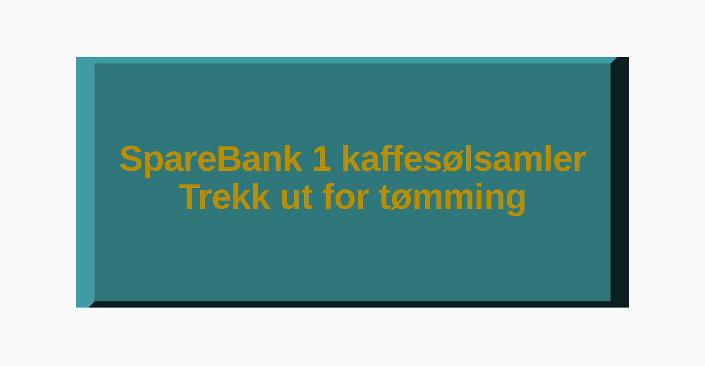

# Kaffesøl-kopp

> English version: [README.md](README.md)

Et lavt trau som fanger opp kaffen som renner ned langs kannen og utover platen, i
stedet for at det ender på bordet og i et tørkepapir. Den står på den frie
forkanten av teakplaten under den internett-tilkoblede kaffevekten, strekker seg ut
over ytterkanten av platen, og griper rundt den grå sokkelen bak seg med to armer.


Selve koppen er **90 × 48 × 20,5 mm** over platen og holder **ca. 46 ml**. Den
hviler på platen over de bakre 30 mm, de forreste 18 mm stikker ut forbi
platekanten, og frontveggen fortsetter ned til bordet – med to linjer tekst gravert
i seg:




## Hovedmål

| Mål | Verdi | Hvor det kommer fra |
|---|---|---|
| Bredde på selve koppen | 90 mm | begynte på 80, som var bredden på tunga foran på platen. Den er 90 nå for å gi teksten på frontflaten plass til å puste. Fortsatt bredeste punkt på hele delen – armene ligger *innenfor* sidene, ikke utenfor. |
| Dybde på platen | 30 mm | fri plate fra forkanten inn mot den grå sokkelen. Låst av riggen: koppen kan ikke bli dypere bakover. |
| Utstikk | 18 mm | ut forbi forkanten av platen, så drypp som renner over kanten også fanges. Var 10; den slakere bakrampen (se under) trenger 7 mm mer dybde enn en på 45°, og siden baksiden står mot sokkelen, legges den ekstra dybden på her. Det er gratis: beinet står på bordet helt fremme, så utstikket blir båret og ikke utkraget, og vippearmen blir bedre (se `foot_clear`). |
| Dybde på koppen | 48 mm | 18 + 30 |
| Total dybde | 66 mm | den høyre armen rekker 18 mm lenger bakover, langs siden av den grå sokkelen. Den venstre er kuttet ned til 14 mm for å gå klar av en kontakt på riggen. |
| Rimhøyde over platen | 20,5 mm | den grå sokkelen er 22 mm, og det er flere mm luft fra toppen av den opp til den store grå koppen, så rimet har god margin. Tilpasset med 2 mm-malen. |
| Platens høyde over bordet | 20,6 mm | hvor langt beinet rekker ned (`plate_height`), tilpasset med malen |
| Total høyde | 40,8 mm | fra bordet til rimet |
| Vegger / bunn | 2,4 / 2,0 mm | |
| Trau | 18,5 mm dypt, 46 ml til rimet | målt fra `mode = "cavity"` |
| Tekst på frontflaten | to linjer, 4,2 mm, gravert 0,6 mm dypt | `text_line1` / `text_line2`, se under |

Selve riggen, målt med skyvelær – det er disse tallene passformen er utledet fra:

| Riggen | Verdi |
|---|---|
| Grå 3D-printet sokkel, bredde | 76 mm |
| Grå 3D-printet sokkel, høyde over teakplaten | 22 mm |
| Grå 3D-printet sokkel, dybde innover | ikke målt, «mye», rundt 76 mm |
| Teakplaten, tykkelse | 19 mm |
| Teakplaten, overflate over bordet | 20,6 mm (`plate_height`, tilpasset med malen) |
| Teakplaten, sett ovenfra | 200 × 200 mm med 45°-avkapp på alle fire hjørner, så den lille sidekanten blir ca. 37 mm – altså en åttekant. Koppen står midt på forkanten, som er rett over ca. 148 mm, så hjørneavkappene er ikke i nærheten. Det er bare spøkelset i `mode = "check"` som bryr seg. |

## Den kan gjerne hvile på bordet

Lastcellen sitter oppe i den grå koppen kannen står i, så både teakplaten og bordet
er dødlast **nedenfor** målekjeden. Hva koppen hviler på har derfor ingen virkning
på vektavlesningen, og kontakt med bordet er en rein fordel: utstikket blir båret
i stedet for utkraget.

Det er nettopp det frontveggen gjør – den fortsetter ned forbi platekanten og står
på bordet:


Forfra og bakover i snittet: **beinet** (4 mm tykt, ned til bordet), **låsetunga**
som henger ned foran forkanten av platen og hindrer at koppen sklir bakover mot
kannen, og så den flate undersiden som hviler på platen.

Tre detaljer i snittet som er der med hensikt:

- **`foot_clear = 0,3` gjør beinet litt kort.** Koppen vipper om forkanten av
  platen, og beinet står 18 mm foran den kanten mens bakkanten ligger 30 mm bak.
  Et bein som er *e* mm for langt løfter derfor bakkanten *1,7 e* mm og spiser av
  klaringen under den grå koppen – det lengre utstikket hjelper her, det var *3 e*
  før. 0,3 mm er lite nok at beinet overtar så snart noe
  presser på utstikket, og nok til at koppen aldri vipper. Sett den til 0 for fast
  kontakt.
- **En 45°-fas på forsiden av tunga**, fra baksiden av beinet ned til det nedre
  fremre hjørnet på tunga. Den flaten ville ellers blitt et tak i printet – se
  under. Fasen fyller mellomrommet mellom beinet og tunga med en kile, og det er
  harmløst siden alt sammen ligger foran platekanten.
- **`hook_relief = 1,0`** skjærer en 45°-avlastning i det innvendige hjørnet der
  undersiden møter tunga, så en avrundet eller lett fasa platekant likevel lar
  koppen sette seg helt ned.

Koppen veier ca. 65 g, som blir et fast tillegg – **tarér vekta** med tom kopp på
plass.

## De to armene – en glidepassform, med vilje

Det som er verdt å gripe rundt, er den **grå 3D-printede sokkelen** som bærer
sensoren: en kloss 76 mm bred som står 22 mm opp fra teakplaten, rett bak koppen.
To finner 2,05 mm tykke rekker bakover fra bakflaten, én langs hver side av den.

De begynte som fjærarmer som klemte om sokkelen, og det er de **ikke lenger**.
`clamp_squeeze` er **−0,1 mm**, altså er åpningen 0,1 mm *videre* enn sokkelen i
stedet for smalere. Armene styrer koppen sideveis og holder den i vinkel med
riggen; låsetunga og vekta av koppen står for holdet. Et grep som må brytes,
slipper med et rykk, og en kopp med kafferester i som trekkes fram for tømming er
det siste stedet du vil ha et rykk. Sett `clamp_squeeze` over 0 for å få et
virkelig grep tilbake – formen er den samme, tallet er hele forskjellen.

Dit kom vi over tre printede tester: 0,4 mm total overlapp, som spriket
`gauge_clamp` ut så den ikke lot seg skyve inn, så 0,2, så 0,1, og til slutt forbi
null til −0,1. Under omtrent 0,1 mm er tallene akademiske uansett: 0,05 mm per side
ligger innenfor målnøyaktigheten til printeren.

De to armene er **ikke like lange**. Den høyre går hele 18 mm, men den venstre
butter i en kontakt på riggen et stykke bakover, så den er kuttet ned til 14 mm
(`clamp_len_l` / `clamp_len_r`; venstre og høyre er sett forfra, der du står og
utstikket peker mot deg, så den venstre armen er den ved x = 0 – bytt om på de to
tallene hvis det viser seg å være den andre siden på riggen din).

Sett ovenfra, med rimet nederst og armene bakover:


Armene ligger **ikke lenger i flukt med sidene**. Det gjorde de da koppen var
80 mm og sokkelen 76: 2,05 mm tykkelse traff nøyaktig det 2 mm store trinnet på
hver side. Ved 90 mm ville den samme regelen krevd en 7 mm plate, så de to er
koblet fra hverandre – `clamp_t` er den tykkelsen finna trenger, og armene ligger
4,9 mm innenfor sidene, der sokkelen setter dem.

| | |
|---|---|
| Styreflater | x = 6,95 og 83,05, altså en åpning på 76,1 mm på den 76 mm brede sokkelen: 0,05 mm klaring per side |
| Arm | 2,05 mm tykk, 17,5 mm høy, 18 mm fri lengde til høyre, 14 mm til venstre |
| Munn ved frie enden | 78,1 mm, avlastet `clamp_lead` = 1,0 mm per side slik at forkantene på sokkelen leder koppen inn i stedet for å hake seg fast i armtippene, og lukker seg inn over de siste 6 mm |
| Undersiden av armen | 1,5 mm over platen (`clamp_z0`), for å gå klar av en eventuell fillet eller elefantfot ved foten av sokkelen |
| Toppen av armen | 19 mm = `tray_height - edge_r`; høyere enn det ville avrundingen av rimet tynnet armen ned til en knivsegg |
| Hvis du legger overlapp tilbake | armen er en bladfjær: `k = 3EI/L³` med `I = b·t³/12` gir ca. 13 N/mm på den 18 mm lange armen i PETG, halvparten mer i PLA+. Stivheten går som 1/lengde³, så den korte 14 mm-armen er 2,1 ganger stivere, og koppen setter seg en hårsbredd ut av senter. |

## Avrundede kanter, og hvorfor ikke `minkowski()`

| Kant | Behandling |
|---|---|
| De fire lange ytterkantene, langs dybden | fillet `edge_r` = 1,5 mm |
| Hele omkretsen av frontflaten | 45°-fas `front_c` = 1,0 mm |
| De to fremre hjørnene, sett ovenfra | 45°-kutt `corner_c` = 3 mm |
| Bakkanten av rimet | fillet `rear_r` = 1,5 mm |
| Bakkanten av undersiden | fillet `under_r` = 0,8 mm |
| Innerkanten av foten, kantene på låsetunga | fillet `foot_r` = 0,6 mm |
| Topp og bunn av armene, yttersiden | fillet `arm_r` = 0,8 mm |
| Frie enden av armene, sett ovenfra | fillet `clamp_r` = 0,4 mm |
| De bakre hjørnene sett ovenfra, og styreflatene | står skarpe – de ligger mot sokkelen, og armene har rota si i de hjørnene |

**Alt som møter printbordet er fasa 45°, ikke avrundet.** En fillet langs
underkanten er tangent til bordet, så førstelaget blir liggende innenfor og
andrelaget henger ca. 0,8 mm ut i lufta; det printer som en ru, hengende leppe.
45° er det bratteste overhenget som kommer rent ut, og en fasa kant er ikke lenger
skarp mot handa. Alt annet er ekte filleter, og de er gratis i printet: de lange
kantene er prismer langs printaksen, og filletene på bakflaten og undersiden bare
krymper tverrsnittet etter hvert som printet vokser oppover. Målt på den ferdige
STL-fila vender ingen flate i delen mot bordet med mer enn nøyaktig 45°.

`minkowski()` med en kule ville avrundet alt på én linje, og på en enkel kloss er
det riktig verktøy. Ikke her: en Minkowski-sum bytter hvert punkt i objektet med
en kule med radius *r*, så **alle utoverflater vokser *r*** – det er definisjonen,
ikke en tilpasning. Den vanlige korreksjonen er å bygge kildeobjektet *r* mindre
først (`cube([w-2*r, d-2*r, h-2*r])` pluss `sphere(r)` gir eksakt w × d × h), men
her finnes det ingen enkelt skalar å krympe – og verre: det ville lukket munnen
mellom armene 2 *r* og gjort beinet ned til bordet *r* for langt, altså
nøyaktig de to målene som ikke får flytte seg. `offset()` og tangerende
fillet-buer fjerner bare materiale, så armavstanden (76,1/76 mm) og beinet
(20,3 mm) kommer ut eksakt som målt. Å runde ett navngitt hjørne av gangen holder
også de innvendige hjørnene skarpe.

## Printet på frontflaten – og hvorfor

Delen printes **liggende på frontflaten**, slik at printaksen går bakover langs
dybden av koppen.


En tidligere versjon sto på en kortende, som er det åpenbare valget for trauet
alene. Armene gjør det umulig: begge styreflatene er plan med konstant x, og står
delen på høykant går printaksen langs x – da blir de styreflatene lagplan, og
innsiden av den øverste armen blir et tak som henger over ingenting. Å stille
koppen opp ned eller rett opp er verre: da ville hele undersiden blitt et tak på
30 × 90 mm i lufta over beinet.

Liggende på frontflaten går alle flater som *må* være loddrette – styreflatene,
sidene på armene – parallelt med printaksen og kommer ut nøyaktig som tegnet. Hele
frontflaten blir førstelaget, 90 × 40,8 mm massiv kontakt med bordet, og bunnen og
veggene i trauet printes som én sammenhengende kontur i hvert enkelt lag, så
hjørnet der de møtes ikke er en lagfuge kaffen kan sive gjennom. De to armene blir
de siste 14 og 18 mm av printet: to finner som står på bakflaten, hver med et fotavtrykk
på 2,05 × 17,5 mm. De printer greit, men senk farten på de siste lagene hvis
sliceren ikke gjør det selv.

Bare to flater vender mot printbordet i denne orienteringen:

1. **Innsiden av bakveggen.** Bunnen av trauet stiger opp til rimet over en radius
   `rear_fillet` = 12 mm og deretter en rett strekning på `rear_angle` = **35°**.
   Den var 45° – teoretisk grense for et overheng uten støtte – og det første
   printet kom ut synlig ru og hengende langs hele den flata i PLA. 45° betyr at
   hvert lag flytter seg en hel laghøyde sideveis, så hver streng blir lagt halvt i
   løse lufta; ved 35° flytter det seg bare 0,7 laghøyder, og det ligger virkelig
   materiale under hver streng. Kjør delkjølingsvifta for full musikk over de
   lagene.

   Den slakere rampen koster dybde: `rear_fillet · sin a + (cav_rise −
   rear_fillet · (1 − cos a)) / tan a` blir **30,2 mm** ved 35° mot 23,5 mm ved
   45°. Siden sokkelen låser baksiden, ble de 7 mm hentet foran, som `overhang`
   10 → 18. Det som står igjen, er en helt flat bunn på 75,2 × 8,0 mm fremst, og
   rampen er like mye en fordel som en kostnad. Trauet er dypest foran, så et søl
   samler seg ut over bordkanten og bort fra riggen. Og den lange slake skråningen
   er der dryppene faktisk lander: en dråpe som treffer den, brer seg ut som en
   tynn film over et mye større område enn den 2 mm dype dammen den ville laget på
   en flat bunn, og den filmen er godt avkjølt når den kommer ned. Større flate,
   mindre dybde, mindre varme – alle tre i riktig retning, og i PLA er det siste
   det som betyr noe.
2. **Forsiden av låsetunga**, fasa 45° som beskrevet over.

Målt på den ferdige STL-fila vender 2423 mm² av flatene mot bordet med 35°
(rampen) og 943 mm² med nøyaktig 45° (fasene). Ingenting er brattere.

De to kortendene trenger ingen slik behandling her – de er prismer langs
printaksen – så innsiden av dem er en rein `inner_fillet` = 5 mm avrunding, og den
flate bunnen beholder full bredde.

## Teksten på frontflaten

Siden frontflaten er førstelaget, kommer den ut som den glatteste flata på hele
delen – som gjør den til rett sted for en merking, og som bestemmer hvordan
merkingen må lages. Den er **gravert, ikke hevet**: hevede bokstaver på den flata
måtte vært printet *under* førstelaget, og det går ikke. `text_depth` = 0,6 mm
fordypning printes som en liten bro over bokstavformene, noe enhver printer klarer,
og i svart filament leser skyggen i fordypningen bedre enn hevede bokstaver ville
gjort.

| | |
|---|---|
| Linjer | `text_line1` = «SpareBank 1 kaffesølsamler», `text_line2` = «Trekk ut for tømming» |
| Størrelse | 4,2 mm på begge linjer, `text_gap` = 2,0 mm mellom dem, `text_font` = Liberation Sans Bold |
| Dybde | 0,6 mm, så det står igjen 1,8 mm av den 2,4 mm tykke veggen – en `assert` holder minst 1,2 mm |
| Plassering | midtstilt i bredden, senter av tekstblokka `text_z` = 1,0 mm over plateflata |

OpenSCAD kan ikke måle en rendret tekst, så størrelsene er satt for hånd: linje 1
er 108,3 mm bred ved størrelse 6 i denne fonten, altså 75,8 mm ved 4,2, innenfor de
`tray_width - 2 · text_margin` = 80 mm som er tilgjengelig. Endrer du en av
strengene, render den for seg og skalér størrelsen på samme måte. Merk at kilden
sier *kaffesølsamler* med e; ta den bort i `text_line1` hvis du vil ha
*kaffsølsamler*.

Ingenting trenger å speilvendes: bokstavene tegnes i (x, z)-planet og ekstruderes
langs +y inn i delen, og frontvisningen ser langs +y, så det du leser i renderingen
er det som kommer av printbordet.

## Testbiter

Tre billige print, i den rekkefølgen det er verdt å lage dem:

| `mode` | Kostnad | Hva den forteller |
|---|---|---|
| `"gauge"` | 3 g | Hele tverrsnittet som en 2 mm skive, liggende flatt. Hekt den på forkanten av platen: rekker beinet ned til bordet, går tunga klar av det som er under platen, er det luft igjen opp til den grå koppen? |
| `"gauge_clamp"` | 3 g | En 2,5 mm skive i toppen av armene – en ring av vegg pluss begge armene, holdt fra hverandre med riktig avstand, og allerede flat. Går armene ned langs sokkelen, finner munnen den, og er det plass til en 2,05 mm arm ved siden av sokkelen? Den var 1,5 mm først, og det var for slapt til å si noe i det hele tatt: den bare spriket ut. Nå som passformen er en glidepassform, er det heller ingenting å bedømme om friksjonen her – bedøm plasseringen og innføringen. |
| `"clip"` | 26 g | De bakre 12 mm av koppen pluss begge armene komplett, stående på kuttflaten. Den eneste testen som viser hvordan koppen virkelig går på og av, men den koster en tredjedel av en kopp, så den er bare verdt det hvis `"gauge_clamp"` gjør deg usikker på `clamp_squeeze`. |

## Printing

| | |
|---|---|
| Printmål | 90 × 40,8 mm fotavtrykk, 66 mm høy, liggende på frontflaten (FlashForge Creator Pro 2: 200 × 148 × 150 mm) |
| Materialforbruk | 51,0 cm³, ca. 65 g |
| Støtte | ingen |
| Brim | trengs ikke – førstelaget er hele frontflaten |
| Vegger | minst 3 perimetre, så de 2,4 mm veggene og de 2,05 mm armene blir massive |
| Kjøling | vifta for full musikk over den 35° bakrampen – det er den ene flata som bryr seg |

**PETG er det riktige materialet, og er fortsatt anbefalingen.** Kaffe rett fra
kannen er 80–90 °C, og PLA begynner å bli mykt like over 55 °C. PETG (eller
ASA/PP) holder formen selv om en full kopp havner i trauet.

**Denne er printet i det som sto på hylla: eSUN PLA+ svart, 1,75 mm,
205–225 °C.** Det er et forsvarlig valg her, og verdt å skrive ned framfor å late
som noe annet:

- Dryppene er få, og de henger en stund på dispenseren før de slipper, så de er
  langt fra kannetemperatur når de lander i et trau som står tomt og har
  romtemperatur. Dette er en søl-fanger, ikke en kaffekopp.
- De lander på den 35° skråningen, ikke i en dam. En dråpe brer seg ut til en tynn
  film på vei ned og gir fra seg varmen til en stor veggflate underveis, så
  plasten ser aldri noe i nærheten av temperaturen dråpen kom med.
- PLA+ er *stivere* enn PETG (E ≈ 2,5–3,5 GPa mot rundt 2,0). Med en
  glidepassform betyr ikke det så mye lenger, men det betyr at armene blir
  stående der de er satt.
- PLA holder også målene bedre enn PETG: mindre krymp og mindre utsvelling i
  hjørnene, og det er det som holder 0,05 mm klaring per side til en klaring.

To ting å holde et øye med ved PLA, og begge handler om *vedvarende* last, ikke om
dryppene:

- **Kryp.** PLA relakserer under konstant tøyning langt lettere enn PETG. Det er
  ingen konstant tøyning i armene lenger, nå som de ikke klemmer, så dette gjelder
  bare hvis du setter `clamp_squeeze` tilbake over 0 – da vil grepet svekkes over
  noen måneder og vil ha en ny print.
- **Ikke tøm en varm kopp i den,** og tørk opp et søl heller enn å la nykokt kaffe
  stå i en 2 mm bunn. Det er det ene tilfellet der PLA faktisk ville blitt mykt.

## Bygge den om selv

```sh
# koppen, liggende på frontflaten, klar for sliceren
openscad -o stl/coffee_spill_mug.stl -D 'mode="print"' coffee_spill_mug.scad

# testbitene
openscad -o stl/coffee_spill_mug_gauge.stl       -D 'mode="gauge"'       coffee_spill_mug.scad
openscad -o stl/coffee_spill_mug_gauge_clamp.stl -D 'mode="gauge_clamp"' coffee_spill_mug.scad
openscad -o stl/coffee_spill_mug_clip.stl        -D 'mode="clip"'        coffee_spill_mug.scad
```

Åpne `coffee_spill_mug.scad` for å se på den i stedet. `mode` bestemmer hva som
tegnes:

| `mode` | |
|---|---|
| `"use"` | som den står på platen. z = 0 er platetoppen, y = 0 er frontflaten, x = 0 er venstre side av koppen |
| `"check"` | som `"use"`, med teakplaten, den grå sokkelen og bordet tegnet som spøkelser for visuell passkontroll |
| `"print"` | liggende på frontflaten, klar for sliceren |
| `"gauge"`, `"gauge_clamp"`, `"clip"` | testbitene over, alle klare for sliceren |
| `"cavity"` | traurommet som et massivt volum, for å måle kapasiteten |

Alle parametrene ligger øverst i fila. `echo` skriver ut ytre mål, den flate
bunnen, armene med styreflatene sine og fotavtrykket i printet; `assert` stopper
renderingen hvis bakrampen ikke får plass i dybden, hvis tunga kolliderer med
beinet eller rekker under foten, hvis en arm havner utenfor siden av koppen, blir
høyere enn sokkelen, kommer inn i avrundingen av rimet eller rekker forbi baksiden
av sokkelen, hvis munnen på armene blir smalere enn sokkelen, hvis tekstfordypningen
etterlater mindre enn 1,2 mm frontvegg, eller hvis en fillet eller fas er for stor
for kanten den skal bryte.
