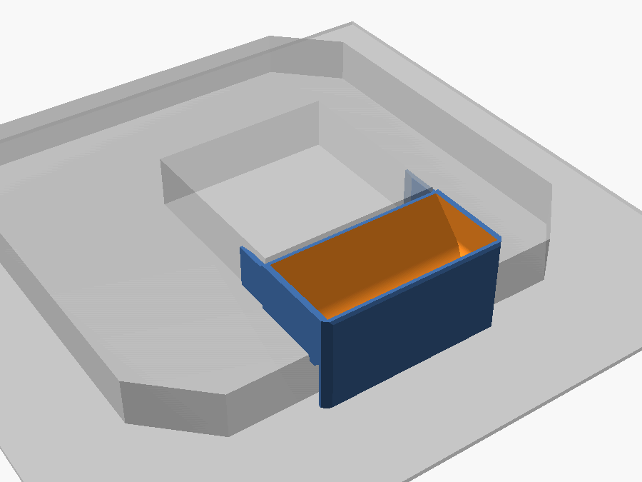
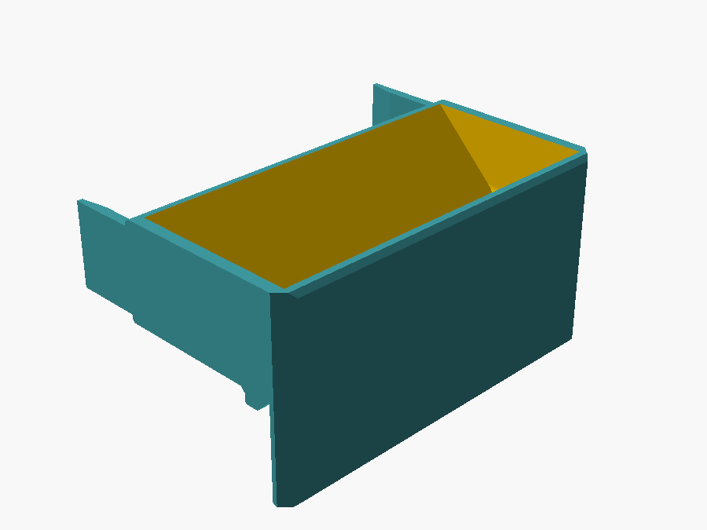
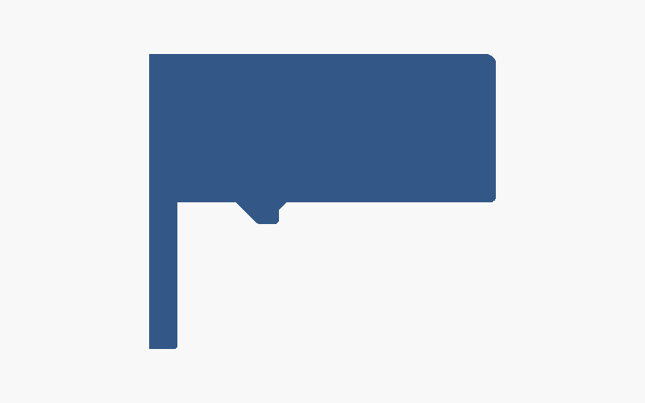
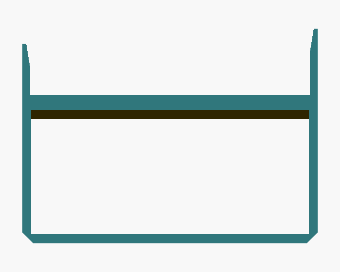
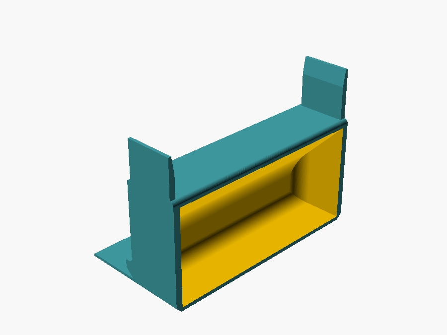

# Kaffesøl-kopp

> English version: [README.md](README.md)

Et lavt trau som fanger opp kaffen som renner ned langs kannen og utover platen, i
stedet for at det ender på bordet og i et tørkepapir. Den står på den frie
forkanten av teakplaten under den internett-tilkoblede kaffevekten, strekker seg ut
over ytterkanten av platen, og griper om den grå sokkelen bak seg med to fjærarmer
når man skyver den på.



Selve koppen er **80 × 40 × 20,5 mm** over platen og holder **ca. 35 ml**. Den
hviler på platen over de bakre 30 mm, de forreste 10 mm stikker ut forbi
platekanten, og frontveggen fortsetter ned til bordet.



## Hovedmål

| Mål | Verdi | Hvor det kommer fra |
|---|---|---|
| Bredde på selve koppen | 80 mm | bredden på tunga foran på platen, målt til 80,10 mm. Dette er også bredeste punkt på hele delen – fjærarmene ligger *innenfor* sidene, ikke utenfor. |
| Dybde på platen | 30 mm | fri plate fra forkanten inn mot den grå sokkelen |
| Utstikk | 10 mm | ut forbi forkanten av platen, så drypp som renner over kanten også fanges |
| Dybde på koppen | 40 mm | 10 + 30 |
| Total dybde | 58 mm | den høyre fjærarmen rekker 18 mm lenger bakover, langs siden av den grå sokkelen. Den venstre er kuttet ned til 14 mm for å gå klar av en kontakt på riggen. |
| Rimhøyde over platen | 20,5 mm | den grå sokkelen er 22 mm, og det er flere mm luft fra toppen av den opp til den store grå koppen, så rimet har god margin. Tilpasset med 2 mm-malen. |
| Platens høyde over bordet | 20,6 mm | hvor langt beinet rekker ned (`plate_height`), tilpasset med malen |
| Total høyde | 40,8 mm | fra bordet til rimet |
| Vegger / bunn | 2,4 / 2,0 mm | |
| Trau | 18,5 mm dypt, 35 ml til rimet | målt fra `mode = "cavity"` |

Selve riggen, målt med skyvelær – det er disse tallene klemmingen er utledet fra:

| Riggen | Verdi |
|---|---|
| Grå 3D-printet sokkel, bredde | 76 mm |
| Grå 3D-printet sokkel, høyde over teakplaten | 22 mm |
| Grå 3D-printet sokkel, dybde innover | ikke målt, «mye», rundt 76 mm |
| Teakplaten, tykkelse | 19 mm |
| Teakplaten, overflate over bordet | 20,6 mm (`plate_height`, tilpasset med malen) |
| Teakplaten, sett ovenfra | 200 × 200 mm med 45°-avkapp på alle fire hjørner, så den lille sidekanten blir ca. 37 mm – altså en åttekant. Koppen står midt på forkanten, som er rett over ca. 148 mm, så hjørneavkappene er ikke i nærheten. Det er bare spøkelset i `mode = "check"` som bryr seg. |

## Den kan gjerne hvile på bordet

Lastcellen sitter oppe i den grå koppen kannen står i, så både teakplaten og bordet
er dødlast **nedenfor** målekjeden. Hva koppen hviler på har derfor ingen virkning
på vektavlesningen, og kontakt med bordet er en rein fordel: utstikket blir båret
i stedet for utkraget.

Det er nettopp det frontveggen gjør – den fortsetter ned forbi platekanten og står
på bordet:



Forfra og bakover i snittet: **beinet** (4 mm tykt, ned til bordet), **låsetunga**
som henger ned foran forkanten av platen og hindrer at koppen sklir bakover mot
kannen, og så den flate undersiden som hviler på platen.

Tre detaljer i snittet som er der med hensikt:

- **`foot_clear = 0,3` gjør beinet litt kort.** Koppen vipper om forkanten av
  platen, og beinet står 10 mm foran den kanten mens bakkanten ligger 30 mm bak.
  Et bein som er *e* mm for langt løfter derfor bakkanten *3 e* mm og spiser av
  klaringen under den grå koppen. 0,3 mm er lite nok at beinet overtar så snart noe
  presser på utstikket, og nok til at koppen aldri vipper. Sett den til 0 for fast
  kontakt.
- **En 45°-fas på forsiden av tunga**, fra baksiden av beinet ned til det nedre
  fremre hjørnet på tunga. Den flaten ville ellers blitt et tak i printet – se
  under. Fasen fyller mellomrommet mellom beinet og tunga med en kile, og det er
  harmløst siden alt sammen ligger foran platekanten.
- **`hook_relief = 1,0`** skjærer en 45°-avlastning i det innvendige hjørnet der
  undersiden møter tunga, så en avrundet eller lett fasa platekant likevel lar
  koppen sette seg helt ned.

Koppen veier ca. 49 g, som blir et fast tillegg – **tarér vekta** med tom kopp på
plass.

## De to fjærarmene

Det som er verdt å gripe om, er den **grå 3D-printede sokkelen** som bærer
sensoren: en kloss 76 mm bred som står 22 mm opp fra teakplaten, rett bak koppen.
Derfor fortsetter hver sidevegg rett og slett bakover forbi bakflaten som en
bladfjær 2,05 mm tykk, og de to sammen griper om den klossen.

De to armene er **ikke like lange**. Den høyre går hele 18 mm, men den venstre
butter i en kontakt på riggen et stykke bakover, så den er kuttet ned til 14 mm
(`clamp_len_l` / `clamp_len_r`; venstre og høyre er sett forfra, der du står og
utstikket peker mot deg, så den venstre armen er den ved x = 0).

Sett ovenfra, med rimet nederst og armene bakover:



Siden sokkelen er 4 mm smalere enn koppen, ligger armene 2,05 mm innenfor sidene –
yttersidene er i flukt med sidene på koppen, og koppen blir stående på nøyaktig
**80 mm bredde**, noe den forrige løsningen (klør som hektet seg ned rundt platen,
84,4 mm over alt) ikke gjorde.

| | |
|---|---|
| Gripeflater | x = 2,05 og 77,95, altså en åpning på 75,9 mm: `clamp_squeeze` = 0,1 mm total overlapp på den 76 mm brede sokkelen |
| Arm | 2,05 mm tykk, 17,5 mm høy, 18 mm fri lengde til høyre, 14 mm til venstre |
| Munn ved frie enden | 77,9 mm, avlastet `clamp_lead` = 1,0 mm per side slik at forkantene på sokkelen kiler armene ut i stedet for å gå rett i dem, og lukker seg inn over de siste 6 mm |
| Undersiden av armen | 1,5 mm over platen (`clamp_z0`), for å gå klar av en eventuell fillet eller elefantfot ved foten av sokkelen |
| Toppen av armen | 19 mm = `tray_height - edge_r`; høyere enn det ville avrundingen av rimet tynnet armen ned til en knivsegg |
| Kraft | ca. 0,7 N ved 0,05 mm utbøying på den 18 mm lange armen, spenningstopp rundt 1 MPa. Stivheten går som 1/lengde³, så den korte 14 mm-armen klemmer omtrent dobbelt så hardt, rundt 1,4 N og 1,6 MPa; koppen setter seg bare en hårsbredd ut av senter av det. |

Bøyningen skjer over hele den frie lengden, ikke i en kort rot, og det er det
som gjør grepet fjærende i stedet for sprøtt. `clamp_squeeze` er tallet du justerer
hvis grepet er for svakt eller koppen er for tung å skyve på. Den startet på
0,4 mm; den første printede `gauge_clamp` gikk innpå sokkelen, men spriket ut og
lot seg ikke skyve helt inn, så den gikk til 0,2 og videre til 0,1 mm. Det siste
steget er verdt å være klar over: 0,1 mm totalt er 0,05 mm per side, som ligger
innenfor målnøyaktigheten til printeren, så det som er igjen av grepet hviler på
ruheten i de to flatene heller enn på overlappen. Blir koppen løs på sokkelen, er
det `clamp_squeeze` som skal opp igjen. Hold `clamp_t` lik
`(tray_width - socle_width + clamp_squeeze) / 2` når du justerer, så blir yttersiden
av armen liggende i flukt med siden på koppen – en `assert` sier fra hvis ikke.

## Avrundede kanter, og hvorfor ikke `minkowski()`

| Kant | Behandling |
|---|---|
| De fire lange ytterkantene, langs dybden | fillet `edge_r` = 1,5 mm |
| Hele omkretsen av frontflaten | 45°-fas `front_c` = 1,0 mm |
| De to fremre hjørnene, sett ovenfra | 45°-kutt `corner_c` = 3 mm |
| Bakkanten av rimet | fillet `rear_r` = 1,5 mm |
| Bakkanten av undersiden | fillet `under_r` = 0,8 mm |
| Innerkanten av foten, kantene på låsetunga | fillet `foot_r` = 0,6 mm |
| Topp og bunn av fjærarmene, yttersiden | fillet `arm_r` = 0,8 mm |
| Frie enden av armene, sett ovenfra | fillet `clamp_r` = 0,4 mm |
| De bakre hjørnene sett ovenfra, og gripeflatene | står skarpe – de ligger mot sokkelen, og armene har rota si i de hjørnene |

**Alt som møter printbordet er fasa 45°, ikke avrundet.** En fillet langs
underkanten er tangent til bordet, så førstelaget blir liggende innenfor og
andrelaget henger ca. 0,8 mm ut i lufta; det printer som en ru, hengende leppe.
45° er det bratteste overhenget som kommer rent ut, og en fasa kant er ikke lenger
skarp mot handa. Alt annet er ekte filleter, og de er gratis i printet: de lange
kantene er prismer langs printaksen, og filletene på bakflaten og undersiden bare
krymper tverrsnittet etter hvert som printet vokser oppover. Målt på den ferdige
STL-fila vender ingen flate i delen mot bordet med mer enn nøyaktig 45°.

`minkowski()` med en kule ville avrundet alt på én linje, og på en enkel kloss er
det riktig verktøy. Ikke her: en Minkowski-sum bytter hvert punkt i objektet med
en kule med radius *r*, så **alle utoverflater vokser *r*** – det er definisjonen,
ikke en tilpasning. Den vanlige korreksjonen er å bygge kildeobjektet *r* mindre
først (`cube([w-2*r, d-2*r, h-2*r])` pluss `sphere(r)` gir eksakt w × d × h), men
her finnes det ingen enkelt skalar å krympe – og verre: det ville lukket munnen
mellom fjærarmene 2 *r* og gjort beinet ned til bordet *r* for langt, altså
nøyaktig de to målene som ikke får flytte seg. `offset()` og tangerende
fillet-buer fjerner bare materiale, så armavstanden (75,9/76 mm) og beinet
(20,3 mm) kommer ut eksakt som målt. Å runde ett navngitt hjørne av gangen holder
også de innvendige hjørnene skarpe.

## Printet på frontflaten – og hvorfor

Delen printes **liggende på frontflaten**, slik at printaksen går bakover langs
dybden av koppen.



En tidligere versjon sto på en kortende, som er det åpenbare valget for trauet
alene. Armene gjør det umulig: begge gripeflatene er plan med konstant x, og står
delen på høykant går printaksen langs x – da blir de gripeflatene lagplan, og
innsiden av den øverste armen blir et tak som henger over ingenting. Å stille
koppen opp ned eller rett opp er verre: da ville hele undersiden blitt et tak på
30 × 80 mm i lufta over beinet.

Liggende på frontflaten går alle flater som *må* være loddrette – gripeflatene,
sidene på armene – parallelt med printaksen og kommer ut nøyaktig som tegnet. Hele
frontflaten blir førstelaget, 80 × 40,8 mm massiv kontakt med bordet, og bunnen og
veggene i trauet printes som én sammenhengende kontur i hvert enkelt lag, så
hjørnet der de møtes ikke er en lagfuge kaffen kan sive gjennom. De to armene blir
de siste 14 og 18 mm av printet: to finner som står på bakflaten, hver med et fotavtrykk
på 2,05 × 17,5 mm. De printer greit, men senk farten på de siste lagene hvis
sliceren ikke gjør det selv.

Bare to flater vender mot printbordet i denne orienteringen, og begge er løst med
45°, det bratteste overhenget som printer uten støtte:

1. **Innsiden av bakveggen.** Bunnen av trauet stiger opp til rimet over en radius
   `rear_fillet` = 12 mm, fra vannrett opp til 45°, og deretter en rett
   45°-strekning. Strekningen koster
   `(tray_height - floor_t) + 0,41 · rear_fillet` = 23,5 mm av de 35,2 mm
   innvendige dybden, og lar en flat bunn på 65 × 6,7 mm stå igjen fremst. Det er
   like mye en fordel som en kostnad: trauet er dypest foran, så et søl samler seg
   ut over bordkanten og bort fra riggen.
2. **Forsiden av låsetunga**, fasa som beskrevet over.

De to kortendene trenger ingen slik behandling her – de er prismer langs
printaksen – så innsiden av dem er en rein `inner_fillet` = 5 mm avrunding, og den
flate bunnen beholder full bredde.

## Testbiter

Tre billige print, i den rekkefølgen det er verdt å lage dem:

| `mode` | Kostnad | Hva den forteller |
|---|---|---|
| `"gauge"` | 2 g | Hele tverrsnittet som en 2 mm skive, liggende flatt. Hekt den på forkanten av platen: rekker beinet ned til bordet, går tunga klar av det som er under platen, er det luft igjen opp til den grå koppen? |
| `"gauge_clamp"` | 2,6 g | En 2,5 mm skive i toppen av armene – en ring av vegg pluss begge armene, holdt fra hverandre med riktig avstand, og allerede flat. Griper armene om sokkelen, finner munnen den, og er det plass til en 2,05 mm arm ved siden av sokkelen? Merk at stivheten til en bladfjær er proporsjonal med høyden, så skiva klemmer bare ca. 1/7 så hardt som den ferdige koppen – bedøm plasseringen og innføringen her, ikke friksjonen. Den var 1,5 mm først (1/12), og det var for slapt til å si noe i det hele tatt: den bare spriket ut. |
| `"clip"` | 22 g | De bakre 12 mm av koppen pluss begge armene komplett, stående på kuttflaten. Dette er den virkelige friksjonstesten, men den koster nesten en halv kopp, så den er bare verdt det hvis `"gauge_clamp"` gjør deg usikker på `clamp_squeeze`. |

## Printing

| | |
|---|---|
| Printmål | 80 × 40,8 mm fotavtrykk, 58 mm høy, liggende på frontflaten (FlashForge Creator Pro 2: 200 × 148 × 150 mm) |
| Materialforbruk | 38,4 cm³, ca. 49 g |
| Støtte | ingen |
| Brim | trengs ikke – førstelaget er hele frontflaten |
| Vegger | minst 3 perimetre, så de 2,4 mm veggene og de 2,05 mm armene blir massive |

**Velg PETG framfor PLA.** Kaffe rett fra kannen er 80–90 °C, og PLA begynner å bli
mykt like over 55 °C. PETG (eller ASA/PP) holder formen når en full kopp havner i
trauet, og er en bedre fjær enn PLA.

## Bygge den om selv

```sh
# koppen, liggende på frontflaten, klar for sliceren
openscad -o stl/coffee_spill_mug.stl -D 'mode="print"' coffee_spill_mug.scad

# testbitene
openscad -o stl/coffee_spill_mug_gauge.stl       -D 'mode="gauge"'       coffee_spill_mug.scad
openscad -o stl/coffee_spill_mug_gauge_clamp.stl -D 'mode="gauge_clamp"' coffee_spill_mug.scad
openscad -o stl/coffee_spill_mug_clip.stl        -D 'mode="clip"'        coffee_spill_mug.scad
```

Åpne `coffee_spill_mug.scad` for å se på den i stedet. `mode` bestemmer hva som
tegnes:

| `mode` | |
|---|---|
| `"use"` | som den står på platen. z = 0 er platetoppen, y = 0 er frontflaten, x = 0 er venstre side av koppen |
| `"check"` | som `"use"`, med teakplaten, den grå sokkelen og bordet tegnet som spøkelser for visuell passkontroll |
| `"print"` | liggende på frontflaten, klar for sliceren |
| `"gauge"`, `"gauge_clamp"`, `"clip"` | testbitene over, alle klare for sliceren |
| `"cavity"` | traurommet som et massivt volum, for å måle kapasiteten |

Alle parametrene ligger øverst i fila. `echo` skriver ut ytre mål, den flate
bunnen, armene med gripeflatene sine og fotavtrykket i printet; `assert` stopper
renderingen hvis bakrampen ikke får plass i dybden, hvis tunga kolliderer med
beinet eller rekker under foten, hvis en arm havner utenfor siden av koppen, blir
høyere enn sokkelen, kommer inn i avrundingen av rimet eller rekker forbi baksiden
av sokkelen, hvis munnen på armene blir smalere enn sokkelen, eller hvis en fillet
eller fas er for stor for kanten den skal bryte.
