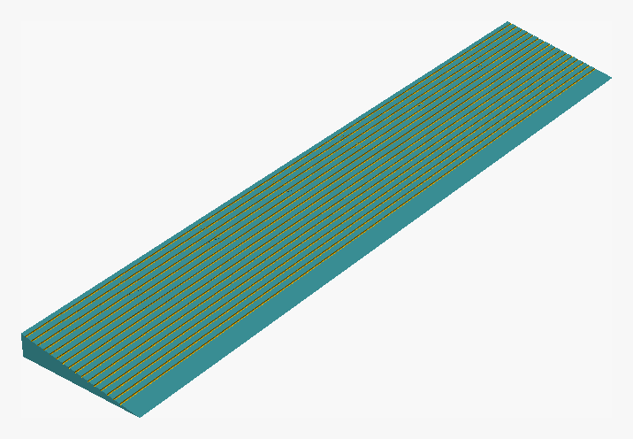
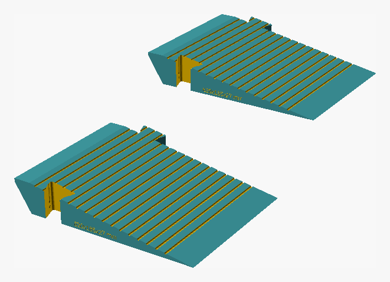
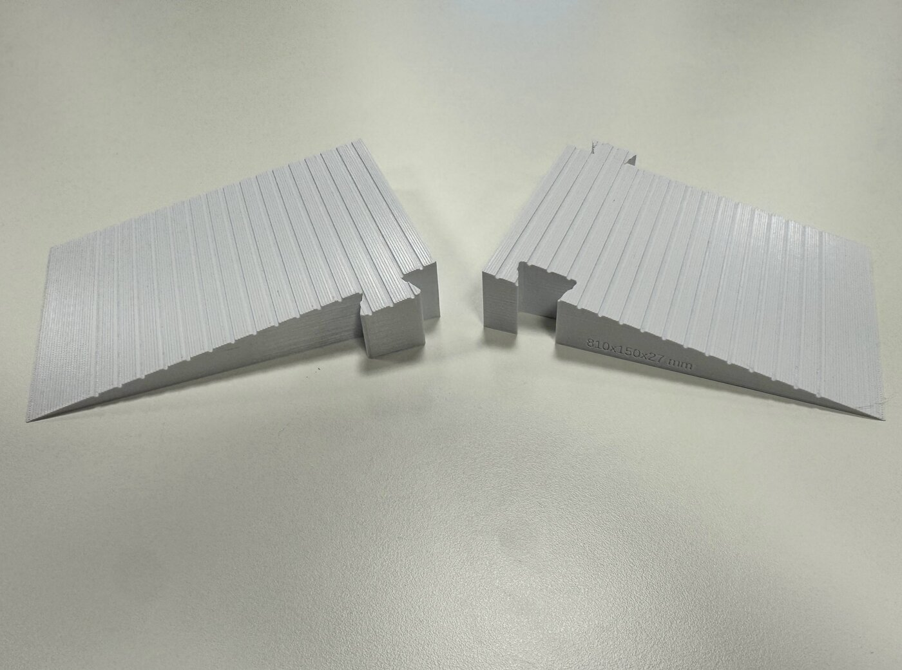
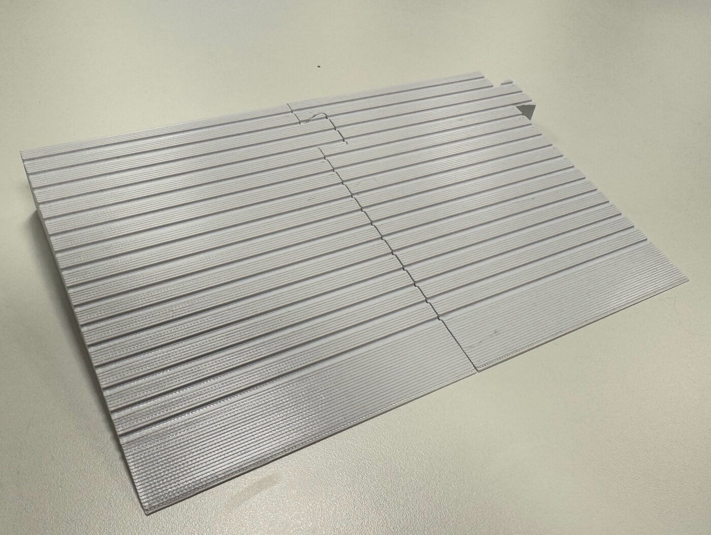
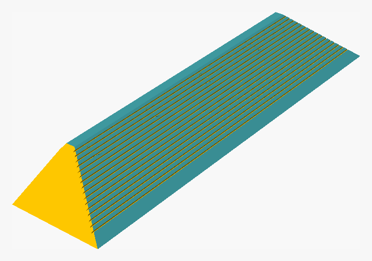
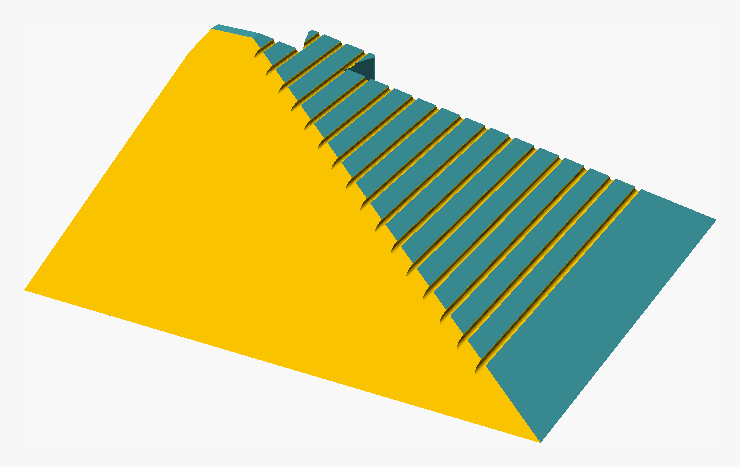

# Threshold ramp (modular)

> Norsk versjon: [README.no.md](README.no.md)

A wedge ramp that lets the robot vacuum drive over a tall door threshold. It
sits on the **outside** of the threshold (the side without the door leaf); on the
inside the robot manages on the stair-like step that is already there.



The profile is a right-angled triangle with legs **27 mm** (height) × **150 mm**
(depth) = **10.2° incline**, total width **810 mm**. The ramp is split into
**7 modules of 115.7 mm** that click together in place, since 810 mm does not fit
on the build plate of a FlashForge Creator Pro 2 (200 × 148 × 150 mm).

The threshold varies from 27 to 42 mm in height. The ramp meets it at 27 mm; the
robot handles the rest of the height difference itself (it manages 20–25 mm
without a ramp).

## Parameterization

Everything sits at the top of `threshold_ramp.scad`:

| Parameter | Meaning |
|---|---|
| `height_profile` | `[[distance from left, height], ...]`. Equal heights = flat top. To make the top follow a threshold that varies, measure e.g. every 100 mm and enter all the points – the top surface is lofted through every point. |
| `ramp_run` | the depth of the inclined plane. 150 → 10.2°, 120 → 12.7°, 100 → 15.1° (at 27 mm) |
| `total_width` | the width of the finished ramp |
| `n_modules` | number of modules; module length = `total_width / n_modules` |
| `bed_x/y/z` | the build volume, used in `assert` |
| `label_enable` | engraves the module number in the back face. Turn on when `height_profile` is not flat, because the modules then have to be assembled in the right order |
| `dim_enable` | engraves the ramp dimensions (`810x150x27 mm`, assembled from the parameters) in the socket end – the short end that is hidden inside the joint. Module 1 has no socket and therefore gets no text |

`echo` prints the angle, module length, print dimensions and which axis the
module should be laid along. `assert` stops the rendering if the module does not
fit on the plate in either of the two orientations, or if the joint ends up on
material that is too thin.

## Matched to the robot

- **10.2° incline** – well below the approx. 15–17° where robot vacuums start to
  spin.
- **The grooves match the drive wheel.** `grip_pitch = 8` mm is the same spacing
  as the lugs in the wheel pattern, and the grooves are approx. 1 mm deep, so the
  lugs get something to grip instead of spinning on smooth plastic.
  `grip_enable = false` gives a completely smooth surface.

## The joint

A dovetail tenon (narrow at the root, wide at the tip) that runs through the full
height in the thick area of the profile. Because it widens outwards, the modules
cannot be pulled apart widthwise – they are assembled by lowering the next module
straight down over the tenon. Two small spherical bumps in the flanks of the
tenon (protruding 0.6 mm) engage matching recesses in the socket and give an
audible click + take up play. The socket wall has a free lead-in channel above
the recess, so the bump slides unobstructed down to the last 2 mm – there it has
to be pressed past the full wall thickness and clicks into place.



Adjustment:

| Parameter | Effect |
|---|---|
| `joint_clear` | clearance. Increase to 0.35–0.4 if the joint is too tight, down towards 0.15 if it is loose |
| `snap_proud` | the click force (effective grip = `snap_proud - joint_clear`). 0.45 = light, 0.8 = tight |
| `snap_engage` | how long a stretch the bump has to be pressed through at the end |
| `snap_enable` | set `false` for a smooth joint without a click |
| `joint_depth`, `joint_neck`, `joint_head` | the size of the tenon |

## Printing

With a flat `height_profile` there are three unique parts, ready in `stl/`:

| File | Quantity | Description |
|---|---|---|
| `ramp_start.stl` | 1 | end module (tenon only) |
| `ramp_middle.stl` | 5 | middle module (tenon + socket) |
| `ramp_end.stl` | 1 | end module (socket only) |

Footprint per print: **129.7 × 150 × 27 mm** – lay the module length along the
Y axis (148 mm) and the 150 mm of the inclined plane along the X axis (200 mm).
The other way round does not work, since 150 > 148.

- Flat bottom down, **no support** needed.
- The volume is large: ~1600 cm³ solid for the whole ramp, i.e. around 0.6–0.8 kg
  of filament with normal settings. Reckon 4–8 hours per module.
- Recommended: PETG or PLA+, 0.2 mm layers, 3–4 perimeters, 20–25 % gyroid. The
  robot only weighs a few kilos, but the ramp should tolerate someone stepping on
  it.
- A brim helps keep the thin tip from coming loose.
- The thin end finishes in a razor-sharp edge. The printer gives it a tip of
  ~0.4 mm; sand or heat off the last few millimeters if it frays.

### The printed result

Photos of `ramp_start.stl` and `ramp_middle.stl` from the 810 mm ramp, printed in
white PETG with 0.2 mm layers:






## The living room door – `livingroom_threshold_ramp.scad`

A variant for the living room double door. Same construction, but **620 mm** wide
in **5 modules of 124 mm**, and with two additions:



- **A 15 mm lip over the threshold.** The top surface continues flat 15 mm past
  the tall face and hangs in the air over the threshold, in the recess between
  the edge of the threshold and the closed door leaf. The underside of the lip is
  chamfered at 45° (`lip_drop = lip_out`), so it still prints flat bottom down
  without support. `lip_out` = how far out, `lip_tip` = the thickness at the
  outer edge, `lip_drop` = the length of the chamfer. Reduce `lip_drop` if the
  recess under the door leaf is shallow (steeper overhang – may need support), or
  set `lip_enable = false` for the plain triangle profile.

  

- **A sideways ramp at the left end.** The left door leaf is almost always
  closed, so the robot cannot drive over the ramp there. The left end (y = 0,
  seen from the adjacent room) is therefore cut down to the floor by a single
  plane over `side_run` = 120 mm ≈ 12.7°, so the robot can drive up onto the ramp
  from the side instead of hitting an end wall. Keep `side_run` **smaller than
  the module length**, so the taper stays inside module 1 and does not touch the
  first joint – there is an `assert` on it.

  

Footprint per print: **138 × 165 × 27 mm** – length along Y (148 mm), the profile
along X (200 mm). Three unique parts, ready in `stl/`:

| File | Quantity | Description |
|---|---|---|
| `livingroom_ramp_start.stl` | 1 | left end module – tapered sideways ramp, tenon only |
| `livingroom_ramp_middle.stl` | 3 | middle module (tenon + socket) |
| `livingroom_ramp_end.stl` | 1 | right end module (socket only) |

The feather edge at the left end is as thin as the tip of the incline – sand or
heat it off if it frays.

## Rebuilding it yourself

```bash
# preview of the whole ramp
openscad threshold_ramp.scad

# export one module (0 .. n_modules-1)
openscad -o stl/ramp_middle.stl -D 'mode="plate"' -D 'part_index=3' threshold_ramp.scad
```

`mode` can be `assembly` (assembled), `plate` (one module for printing) or
`all_parts` (all modules side by side).

The `.png` pictures in `img/` are rendered the same way, with `--render` (F6) so
they show the finished geometry and not the preview (the `.jpg` files are photos
of the printed parts):

```bash
openscad -o img/livingroom_assembly.png --render --imgsize=1400,900 \
         --camera=0,0,0,58,0,38,0 --viewall --autocenter \
         --colorscheme=Tomorrow livingroom_threshold_ramp.scad
magick img/livingroom_assembly.png -trim +repage \
       -bordercolor '#f7f7f7' -border 24 img/livingroom_assembly.png
```

The two colours are OpenSCAD's front/back face shading, not an error in the
model – all the STLs are closed, consistently oriented manifolds.

## Assembly

Lay the modules against the threshold from one side, lowering each new module
straight down over the tenon until it clicks. Feel free to fix the whole ramp to
the floor with double-sided carpet tape if it wanders when the robot bumps into
it.
